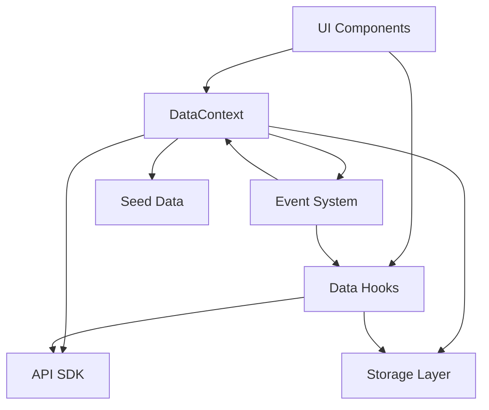
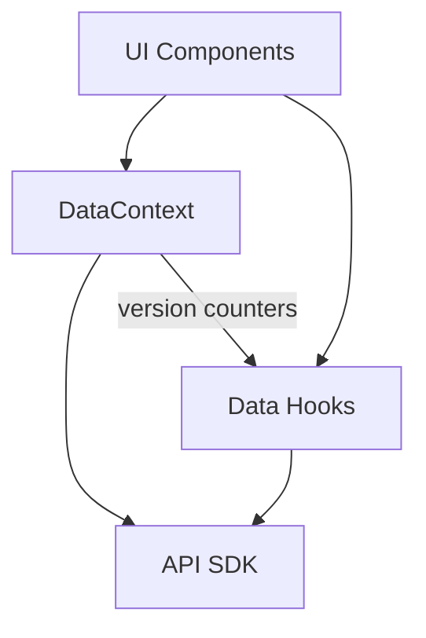
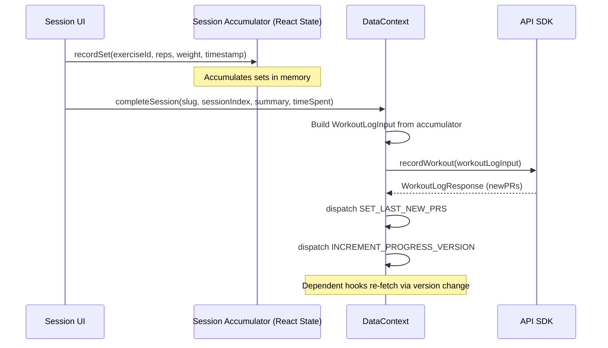

# Design Document: Backend-Only Refactor

## Overview

This refactor transforms the Progressive Workout app from a hybrid local-storage/API architecture to a fully stateless, API-only architecture. The core changes are:

1. Delete `lib/storage.ts` and `lib/events.ts` entirely
2. Rewrite `DataContext` to fetch/mutate exclusively through the API SDK (`lib/api.ts`)
3. Replace event-driven reactivity with version-counter-based re-fetching (already partially in place)
4. Accumulate workout session data in React state instead of writing events to storage
5. Migrate all storage-dependent hooks to use API endpoints
6. Remove seed data loading and local storage fallbacks from all components

The existing API SDK, mappers (`lib/mappers/workout.ts`, `lib/mappers/stats.ts`), and Firebase auth integration remain unchanged.

## Architecture

### Current Architecture (Before)



### Target Architecture (After)



Key changes:

- Storage Layer removed entirely
- Event System removed entirely
- Seed Data loading removed
- All data flows through API SDK
- Version counters in DataContext trigger hook re-fetches (existing pattern, already used by API-migrated hooks)

### Data Flow: Session Completion



## Components and Interfaces

### 1. DataContext (Refactored)

The DataContext retains its existing interface but removes all storage and event dependencies.

**State shape** (unchanged):

```typescript
interface DataState {
  exercises: Exercise[]
  exercisesLoading: boolean
  programs: Program[]
  programsLoading: boolean
  lastCompletedSlug: string | null
  lastNewPRs: NewPREntry[]
  progressVersion: number
  historyVersion: number
  completedVersion: number
}
```

**Actions interface** (simplified):

```typescript
interface DataActions {
  // Session completion — takes accumulated sets directly
  completeSession: (
    slug: string,
    sessionIndex: number,
    summary: string,
    timeSpentSeconds: number,
    accumulatedSets: AccumulatedSet[]
  ) => Promise<void>

  // Refresh
  refreshAll: () => void
  refreshProgress: () => void

  // Exercise CRUD (API-only, throws on failure)
  upsertExercise: (input: ExerciseInput) => Promise<Exercise>
  deleteExercise: (id: string) => Promise<void>

  // Program CRUD (API-only, throws on failure)
  upsertProgram: (input: ProgramInput) => Promise<Program>
  deleteProgram: (id: string) => Promise<void>
}
```

**Removed from DataContext**:

- `recordEvent` — no more event storage
- `saveSessionState` / `loadSessionState` — no session persistence
- `refreshHistory` / `refreshCompleted` — consolidated into `refreshProgress` (single version counter triggers all dependent hooks)
- All `storage.*` calls
- All `dataEvents.*` calls
- Seed data import (`assets/data/programs.json`)
- Local storage merge logic in exercise/program loading
- `bulkDeleteExercises` / `bulkDeletePrograms` — these used storage directly; can be re-added later with API batch endpoints
- `duplicateProgram` — used storage; re-implement via API create
- `importData` — used storage; re-implement via API create calls
- `exportData` — can remain as-is (reads from state, not storage)

### 2. Session Accumulator

A new type and pattern for collecting workout data in memory during a session.

```typescript
interface AccumulatedSet {
  exerciseId: string
  reps: number
  weight?: number
  isBodyweight: boolean
  timestamp: string
}
```

The session screen maintains an `AccumulatedSet[]` in local React state (via `useState` or `useReducer`). When the session completes, this array is passed to `completeSession` which builds the `WorkoutLogInput`.

### 3. Data Hooks (Refactored)

Hooks that currently import `storage` will be rewritten:

| Hook                   | Current Source                    | New Source                       | Notes                                            |
| ---------------------- | --------------------------------- | -------------------------------- | ------------------------------------------------ |
| `useWeeklyActivity`    | `storage.loadAllStreaks()`        | `fetchWeeklyStats()`             | Map API weekly stats to day-of-week activity     |
| `useLiveProgress`      | `storage.loadStreak()`            | `fetchProgress()`                | Map API progress to streak-like data             |
| `useLiveHistory`       | `storage.loadHistory()`           | `fetchProgress().recentActivity` | Use recentActivity from progress endpoint        |
| `useProgramProgress`   | `storage.loadProgramProgress()`   | `fetchProgress()`                | TODO: backend needs per-program tracking         |
| `useSessionCompletion` | `storage.loadCompletedSessions()` | `fetchProgress()`                | TODO: backend needs per-program session tracking |
| `useChallengeProgress` | `storage.loadChallengeProgress()` | `fetchProgress()`                | TODO: backend has no challenge concept           |

Hooks already using the API (no changes needed):

- `useAllProgress`, `usePRs`, `useWeeklyStats`, `useConsistencyData`, `useExerciseProgression`
- `useAPIExercises`, `useAPIPrograms`

### 4. ProgressCalendar Component (Refactored)

Currently reads from `storage.getProgressHistory()`. Will be rewritten to use the `useConsistencyData` hook (which already fetches from `fetchConsistency` API).

### 5. Profile Screen (Refactored)

Remove "Clear Progress Data" and "Clear All Data" buttons that call `storage.clearAllProgressData()` and `storage.clearAllData()`. Replace with a simple "Log Out" action (already present).

### 6. Program Prioritization (Refactored)

`lib/utils/programPrioritization.ts` currently reads from `storage.loadAllProgramProgress()` and `storage.loadAllChallengeProgress()`. Will be simplified to use data available from the `fetchProgress` API endpoint, or accept pre-fetched data as parameters instead of reading storage directly.

## Data Models

### Existing Models (Preserved)

The following types remain unchanged:

- `Exercise` — fetched from `GET /api/v1/exercises`
- `Program` — mapped from `APIWorkout` via `workoutToProgram()`
- `WorkoutLogInput` / `WorkoutLogResponse` — used for session completion POST
- `PersonalRecord` — mapped from `APIPR` via `mapPR()`
- `WeeklyStats` — mapped from `APIWeeklyStats` via `mapWeeklyStats()`
- `AggregatedProgress` — mapped from `APIProgress` via `mapProgress()`

### New Model: AccumulatedSet

```typescript
interface AccumulatedSet {
  exerciseId: string
  reps: number
  weight?: number
  isBodyweight: boolean
  timestamp: string // ISO datetime
}
```

### Models to Remove

Types that exist solely for the storage/event layer:

- `EventRecord` — used by `storage.appendEvent()` / `storage.loadEvents()`
- `HistoryFile` — used by `storage.loadAllHistory()`
- `HistoryEntry` — used by `storage.loadHistory()` / `storage.appendHistory()`
- `StreakEntry` — used by `storage.loadAllStreaks()` / `storage.loadStreak()`
- `SessionState` — used by `storage.loadSessionState()` / `storage.saveSessionState()`
- `DataEvent` / `DataEventType` / `DataEventCallback` — used by the event system
- `ProgramProgress` — used by `storage.loadProgramProgress()` (if not repurposed)
- `ChallengeProgress` — used by `storage.loadChallengeProgress()` (if not repurposed)
- `ProgressHistory` — used by `storage.getProgressHistory()`

Note: Some of these types may still be referenced by other parts of the codebase. During cleanup, verify each type's usage before removal. Types that are used by API responses or mappers should be preserved.

### Existing Mappers (Preserved)

- `lib/mappers/workout.ts` — `workoutToProgram()`, `programToWorkoutInput()`, `workoutBlockToProgram()`, `programBlockToWorkout()`
- `lib/mappers/stats.ts` — `mapPR()`, `mapProgress()`, `mapWeeklyStats()`, `mapConsistencyEntries()`

## Correctness Properties

_A property is a characteristic or behavior that should hold true across all valid executions of a system — essentially, a formal statement about what the system should do. Properties serve as the bridge between human-readable specifications and machine-verifiable correctness guarantees._

### Property 1: Exercises load exclusively from API

_For any_ set of exercises returned by the `fetchExercises` API, after DataContext initialization with an authenticated user, the `exercises` state should equal the API response sorted by name, with no additional items from local storage or seed data.

**Validates: Requirements 1.1, 3.1**

### Property 2: Programs load exclusively from API

_For any_ set of workouts returned by the `fetchWorkouts` API, after DataContext initialization with an authenticated user, the `programs` state should equal the workouts mapped through `workoutToProgram` and sorted by name, with no additional items from seed data or local storage.

**Validates: Requirements 1.2, 3.2, 7.1**

### Property 3: Exercise mutations reflect API state

_For any_ valid exercise input, after calling `upsertExercise` or `deleteExercise`, the `exercises` state should match the full exercise list returned by a subsequent `fetchExercises` call, sorted by name.

**Validates: Requirements 2.1, 3.3, 3.4**

### Property 4: API errors propagate without fallback

_For any_ API error thrown during a CRUD operation (create, update, delete exercise or program), the DataContext action should reject with that error and the state should remain unchanged from before the operation.

**Validates: Requirements 3.5, 8.2**

### Property 5: Session accumulator to WorkoutLogInput transformation

_For any_ list of `AccumulatedSet` entries, building a `WorkoutLogInput` should correctly group sets by `exerciseId`, preserve all set data (reps, weight, isBodyweight, timestamp), and include every accumulated set exactly once.

**Validates: Requirements 4.1, 4.2**

### Property 6: Weekly activity hook maps API response correctly

_For any_ `APIWeeklyStats` response, the `useWeeklyActivity` hook should return data derived from the API response that accurately represents the weekly activity pattern.

**Validates: Requirements 5.1**

### Property 7: Live progress hook maps API response correctly

_For any_ `APIProgress` response, the `useLiveProgress` hook should return progress data derived from the API response fields.

**Validates: Requirements 5.2**

### Property 8: Live history hook maps API response correctly

_For any_ `APIProgress` response with `recentActivity` entries, the `useLiveHistory` hook should return the recent activity list from the API response.

**Validates: Requirements 5.3**

### Property 9: API errors set hook error state

_For any_ API error (network error, timeout, HTTP error), a data hook should set its `error` state to a non-null value containing a descriptive message, and should not silently return empty data.

**Validates: Requirements 8.1, 8.4**

### Property 10: refreshAll re-fetches and increments versions

_For any_ state where exercises and programs are loaded, calling `refreshAll` should result in state that matches the current API responses and version counters that are strictly greater than before the call.

**Validates: Requirements 3.7, 4.3**

### Property 11: Program prioritization produces correct ordering

_For any_ list of programs and associated progress data, the `prioritizePrograms` function should return programs sorted by priority score descending, with ties broken by name alphabetically.

**Validates: Requirements 6.3**

## Error Handling

### API Unavailable

When the API is disabled (`EXPO_PUBLIC_API_ENABLED !== 'true'`) or the base URL is not configured:

- Data hooks set `error` to an `APIError` with code `API_DISABLED`
- DataContext sets exercises and programs to empty arrays
- UI components should check for error state and display appropriate messaging

### Network Errors

When network requests fail (timeout, DNS failure, connection refused):

- The API SDK throws `APIError` with code `NETWORK_ERROR` or `TIMEOUT`
- DataContext CRUD actions propagate the error to the caller
- The caller (UI component) should catch the error and display an error popup
- No silent fallback to local data

### Authentication Errors

When the user is not authenticated or the token is expired:

- The API SDK throws `APIError` with code `NO_AUTH` or `TOKEN_ERROR`
- DataContext detects unauthenticated state via `onAuthStateChanged` and sets empty state
- CRUD operations throw immediately if no user is authenticated

### HTTP Errors

When the API returns non-2xx status codes:

- The API SDK throws `APIError` with code `HTTP_ERROR` and the status code
- 404 errors during delete are treated as success (item already gone)
- 409 conflicts during create/update are propagated to the caller

### Backend Feature Gaps

For features the backend doesn't support yet:

- `useProgramProgress`: Returns placeholder metrics with TODO comment
- `useSessionCompletion`: Returns empty Set with TODO comment
- `useChallengeProgress`: Returns placeholder metrics with TODO comment
- These hooks should still use the `fetchProgress` API where possible to provide partial data

## Testing Strategy

### Testing Framework

- **Vitest** for test runner
- **fast-check** for property-based testing
- Tests located in `__tests__/` mirroring source structure

### Unit Tests

Unit tests for specific examples and edge cases:

- DataContext initialization with no authenticated user → empty state
- DataContext initialization with authenticated user and API returning empty arrays → empty state
- `completeSession` with zero accumulated sets → should still POST minimal workout log
- `ProgressCalendar` using `useConsistencyData` hook instead of storage
- Profile screen without "Clear Data" buttons
- API disabled scenario → hooks return error state

### Property-Based Tests

Each correctness property should be implemented as a property-based test using fast-check with minimum 100 iterations.

Property tests to implement:

1. **Property 1**: Generate random exercise arrays, mock `fetchExercises` to return them, verify DataContext state matches sorted API response
2. **Property 2**: Generate random workout arrays, mock `fetchWorkouts` to return them, verify DataContext state matches mapped and sorted API response
3. **Property 3**: Generate random exercise mutations, verify state always matches post-mutation API response
4. **Property 4**: Generate random API errors, verify they propagate without state change
5. **Property 5**: Generate random `AccumulatedSet[]` arrays, verify `WorkoutLogInput` groups correctly and preserves all data
6. **Property 6-8**: Generate random API responses, verify hook transformations are correct
7. **Property 9**: Generate random API errors, verify hooks set error state
8. **Property 10**: Verify refreshAll increments versions and re-fetches
9. **Property 11**: Generate random program lists with progress data, verify sort order

### Test Tagging

Each property test should include a comment referencing the design property:

```typescript
// Feature: backend-only-refactor, Property 5: Session accumulator to WorkoutLogInput transformation
```

### Integration Tests

- Full DataContext lifecycle: mount → load → mutate → verify state
- Session completion flow: accumulate sets → complete → verify API call
- Error propagation: API failure → error in UI
