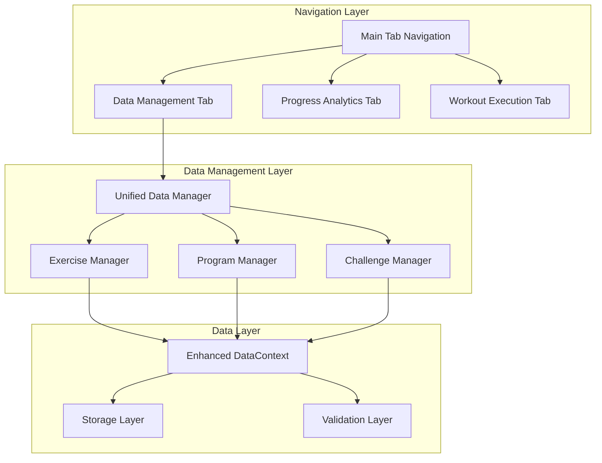
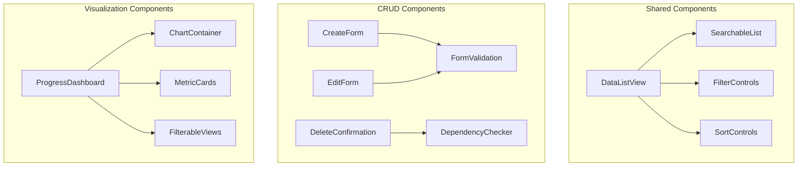

# Design Document: Data Management Reorganization

## Overview

This design addresses the reorganization of data visualizations and implementation of comprehensive CRUD operations for the Progressive Workout app. The current architecture scatters data management across multiple tabs and lacks consistent interfaces for managing exercises, programs, and challenges. This redesign introduces a unified data management system with enhanced user experience and robust data operations.

The solution leverages the existing React Native architecture with Expo Router, TypeScript, and the current DataContext pattern while introducing new navigation patterns and component structures to improve data organization and accessibility.

## Architecture

### High-Level Architecture



### Navigation Restructure

The current tab-based navigation will be enhanced with a new organizational structure:

1. **Home Tab**: Quick access to recent workouts and daily progress
2. **Library Tab**: Unified data management interface (replaces current library)
3. **Analytics Tab**: Dedicated progress visualization (enhanced from current progress)
4. **Workouts Tab**: Active workout execution and session management

### Component Architecture



## Components and Interfaces

### Core Data Management Components

#### UnifiedDataManager

Central component managing the data interface with tabbed navigation between exercises, programs, and challenges.

```typescript
interface UnifiedDataManagerProps {
  initialTab?: "exercises" | "programs" | "challenges";
  searchQuery?: string;
}

interface DataManagerState {
  activeTab: DataType;
  searchQuery: string;
  filters: FilterState;
  sortOrder: SortOrder;
  selectedItems: string[];
}
```

#### Enhanced CRUD Forms

```typescript
interface CRUDFormProps<T> {
  mode: "create" | "edit";
  initialData?: Partial<T>;
  onSave: (data: T) => Promise<void>;
  onCancel: () => void;
  validationSchema: ValidationSchema<T>;
}

interface ExerciseFormData {
  name: string;
  category: ExerciseCategory;
  icon: string;
  description?: string;
  instructions?: string;
  muscleGroups?: string[];
}

interface ProgramFormData {
  name: string;
  description?: string;
  difficulty: "beginner" | "intermediate" | "advanced";
  estimatedDuration: number;
  sessions: ProgramSessionData[];
  tags?: string[];
}

interface ChallengeFormData {
  name: string;
  description?: string;
  exerciseId: string;
  targetReps: number;
  duration: number; // days
  progressionType: "linear" | "percentage";
  sessionIncreasePercent: number;
}
```

#### Advanced Search and Filter System

```typescript
interface SearchState {
  query: string;
  filters: {
    category?: ExerciseCategory[];
    source?: ("builtin" | "user")[];
    difficulty?: string[];
    tags?: string[];
    dateRange?: DateRange;
  };
  sortBy: "name" | "created" | "updated" | "usage";
  sortOrder: "asc" | "desc";
}

interface SearchResult<T> {
  items: T[];
  totalCount: number;
  hasMore: boolean;
  facets: SearchFacets;
}
```

### Enhanced Data Context

The existing DataContext will be extended with additional capabilities:

```typescript
interface EnhancedDataContextValue extends DataContextValue {
  // Enhanced CRUD operations
  actions: DataActions & {
    // Bulk operations
    bulkDeleteExercises: (ids: string[]) => Promise<void>;
    bulkDeletePrograms: (ids: string[]) => Promise<void>;
    duplicateProgram: (id: string, newName: string) => Promise<Program>;

    // Advanced search
    searchData: <T>(query: SearchQuery) => Promise<SearchResult<T>>;

    // Import/Export
    exportData: (type: DataType, ids?: string[]) => Promise<ExportData>;
    importData: (data: ImportData) => Promise<ImportResult>;

    // Validation
    validateDependencies: (
      type: DataType,
      id: string
    ) => Promise<DependencyCheck>;

    // Analytics
    getUsageStats: (type: DataType, id: string) => Promise<UsageStats>;
  };

  // Enhanced state
  state: DataState & {
    searchCache: Map<string, SearchResult<any>>;
    validationErrors: ValidationError[];
    operationStatus: OperationStatus;
  };
}
```

## Data Models

### Enhanced Exercise Model

```typescript
interface EnhancedExercise extends Exercise {
  description?: string;
  instructions?: string;
  muscleGroups?: string[];
  difficulty?: "beginner" | "intermediate" | "advanced";
  equipment?: string[];
  tags?: string[];
  usageCount?: number;
  lastUsed?: string;
}
```

### Enhanced Program Model

```typescript
interface EnhancedProgram extends Program {
  difficulty?: "beginner" | "intermediate" | "advanced";
  estimatedDuration?: number; // minutes
  tags?: string[];
  thumbnail?: string;
  usageCount?: number;
  lastUsed?: string;
  averageRating?: number;
}
```

### Enhanced Challenge Model

```typescript
interface EnhancedChallenge extends Program {
  challengeConfig: ChallengeConfig & {
    difficulty?: "beginner" | "intermediate" | "advanced";
    duration?: number; // days
    progressionType?: "linear" | "percentage";
    tags?: string[];
  };
  participantCount?: number;
  completionRate?: number;
}
```

### Validation Schemas

```typescript
interface ValidationSchema<T> {
  fields: FieldValidation<T>[];
  customValidators?: CustomValidator<T>[];
}

interface FieldValidation<T> {
  field: keyof T;
  required?: boolean;
  minLength?: number;
  maxLength?: number;
  pattern?: RegExp;
  customValidator?: (value: any) => ValidationResult;
}

interface DependencyCheck {
  canDelete: boolean;
  dependencies: {
    programs?: Program[];
    challenges?: Program[];
    sessions?: SessionProgress[];
  };
  warnings: string[];
}
```

## Correctness Properties

_A property is a characteristic or behavior that should hold true across all valid executions of a system-essentially, a formal statement about what the system should do. Properties serve as the bridge between human-readable specifications and machine-verifiable correctness guarantees._

<function_calls>
<invoke name="prework">
<parameter name="featureName">data-management-reorganization

### Property Reflection

After analyzing all acceptance criteria, I identified several areas where properties can be consolidated to eliminate redundancy:

1. **CRUD Operations**: Properties for create, edit, and delete operations can be combined into comprehensive CRUD properties for each data type
2. **Validation**: Multiple validation properties can be consolidated into comprehensive validation properties
3. **Search and Filtering**: Search and filter properties can be combined into unified search functionality properties
4. **Data Integrity**: Import/export and dependency checking can be combined into data integrity properties

### Correctness Properties

Property 1: **Data type navigation consistency**
_For any_ data type (exercises, programs, challenges), switching to that data type should display the appropriate interface and data
**Validates: Requirements 1.3**

Property 2: **Metadata display completeness**
_For any_ data item displayed in lists, the interface should show all relevant metadata including creation date, usage count, and source type
**Validates: Requirements 1.4**

Property 3: **Universal search functionality**
_For any_ search query and data type combination, the search should return relevant results and support filtering capabilities
**Validates: Requirements 1.5, 7.1, 7.2**

Property 4: **Exercise CRUD operations**
_For any_ valid exercise data, the system should allow creation, modification (for user exercises), and deletion (when no dependencies exist)
**Validates: Requirements 2.1, 2.2, 2.4**

Property 5: **Built-in exercise protection**
_For any_ built-in exercise, attempts to modify or delete should be prevented with appropriate error messaging
**Validates: Requirements 2.3**

Property 6: **Exercise categorization validation**
_For any_ exercise creation or modification, only predefined categories (strength, cardio, flexibility, skill) should be accepted
**Validates: Requirements 2.5**

Property 7: **Icon library validation**
_For any_ exercise icon assignment, only valid icons from the predefined library should be accepted
**Validates: Requirements 2.6**

Property 8: **Program session manipulation**
_For any_ program session, adding, removing, and reordering of blocks should maintain valid session structure
**Validates: Requirements 3.2**

Property 9: **Exercise block configuration**
_For any_ exercise block in a program, target reps, duration, and notes should be configurable and validated
**Validates: Requirements 3.3**

Property 10: **Program duplication integrity**
_For any_ program duplication operation, all sessions, blocks, and metadata should be preserved in the copy
**Validates: Requirements 3.4**

Property 11: **Program structure validation**
_For any_ program save operation, all exercise references must exist and all durations must be positive values
**Validates: Requirements 3.5, 8.2**

Property 12: **Challenge parameter configuration**
_For any_ challenge creation or modification, all progression parameters should be configurable and validated for positive values and achievable rates
**Validates: Requirements 4.1, 4.2, 4.5**

Property 13: **Challenge session generation**
_For any_ valid challenge configuration, the system should generate appropriate dynamic session plans
**Validates: Requirements 4.4**

Property 14: **Challenge recalculation consistency**
_For any_ challenge parameter modification, session requirements should be recalculated and preview should update accordingly
**Validates: Requirements 4.3**

Property 15: **Progress data organization**
_For any_ progress visualization, data should be properly organized by type (programs, challenges, exercises) with appropriate filtering options
**Validates: Requirements 5.2, 5.3**

Property 16: **Exercise progression visualization**
_For any_ exercise with progress data, trend charts should display correctly with personal records highlighted
**Validates: Requirements 5.4**

Property 17: **Progress report export**
_For any_ progress data selection, reports should be exportable in specified formats
**Validates: Requirements 5.5**

Property 18: **Dashboard customization**
_For any_ metric selection changes, the dashboard display should update to reflect the chosen metrics
**Validates: Requirements 5.6**

Property 19: **Data export operations**
_For any_ data export request (individual or bulk), the system should generate valid export data
**Validates: Requirements 6.1**

Property 20: **Import validation and integrity**
_For any_ import operation, data structure and dependencies should be validated, and data integrity should be maintained throughout the process
**Validates: Requirements 6.2, 6.6**

Property 21: **QR code sharing workflow**
_For any_ shareable item (program or challenge), QR code generation should work and import should require preview and confirmation
**Validates: Requirements 6.3, 6.4**

Property 22: **Import conflict resolution**
_For any_ import operation with conflicts, the system should offer merge, replace, or skip options
**Validates: Requirements 6.5**

Property 23: **Search result presentation**
_For any_ search results, matching terms should be highlighted and relevance scores should be displayed
**Validates: Requirements 7.4**

Property 24: **Search query management**
_For any_ search query, it should be saveable as a favorite and retrievable for quick access
**Validates: Requirements 7.5**

Property 25: **Usage tracking display**
_For any_ search interface access, recently used and frequently accessed items should be displayed correctly
**Validates: Requirements 7.6**

Property 26: **Input validation consistency**
_For any_ user input across all forms, validation should be applied according to defined constraints
**Validates: Requirements 8.1**

Property 27: **Dependency checking**
_For any_ deletion attempt, the system should check for dependencies and prevent orphaned references
**Validates: Requirements 8.3**

Property 28: **Audit logging**
_For any_ data modification or deletion operation, appropriate audit logs should be maintained
**Validates: Requirements 8.6**

Property 29: **Loading indicator display**
_For any_ operation taking longer than 200ms, loading indicators should be displayed
**Validates: Requirements 9.6**

Property 30: **Accessibility compliance**
_For any_ interface element, sufficient color contrast ratios should be maintained and alternative text should be provided for complex data
**Validates: Requirements 10.3, 10.4**

Property 31: **Haptic feedback consistency**
_For any_ important action on supported devices, appropriate haptic feedback should be triggered
**Validates: Requirements 10.6**

## Error Handling

### Validation Error Handling

The system implements comprehensive validation at multiple levels:

1. **Client-side validation**: Immediate feedback for form inputs
2. **Business logic validation**: Ensures data consistency and referential integrity
3. **Storage validation**: Final validation before persistence

```typescript
interface ValidationError {
  field: string;
  message: string;
  code: ValidationErrorCode;
  severity: "error" | "warning" | "info";
}

enum ValidationErrorCode {
  REQUIRED_FIELD = "REQUIRED_FIELD",
  INVALID_FORMAT = "INVALID_FORMAT",
  DUPLICATE_NAME = "DUPLICATE_NAME",
  INVALID_REFERENCE = "INVALID_REFERENCE",
  DEPENDENCY_EXISTS = "DEPENDENCY_EXISTS",
  INSUFFICIENT_PERMISSIONS = "INSUFFICIENT_PERMISSIONS"
}
```

### Dependency Management

The system prevents orphaned references through comprehensive dependency checking:

```typescript
interface DependencyChecker {
  checkExerciseDependencies(exerciseId: string): Promise<DependencyResult>;
  checkProgramDependencies(programId: string): Promise<DependencyResult>;
  validateExerciseReferences(program: Program): Promise<ValidationResult>;
}

interface DependencyResult {
  canDelete: boolean;
  dependentPrograms: Program[];
  dependentChallenges: Program[];
  activeSessions: SessionProgress[];
  warnings: string[];
}
```

### Import/Export Error Handling

Robust error handling for data transfer operations:

```typescript
interface ImportResult {
  success: boolean;
  imported: ImportedItem[];
  skipped: SkippedItem[];
  errors: ImportError[];
  conflicts: ConflictResolution[];
}

interface ImportError {
  item: any;
  reason: string;
  code: ImportErrorCode;
  recoverable: boolean;
}
```

## Testing Strategy

### Dual Testing Approach

The implementation will use both unit tests and property-based tests to ensure comprehensive coverage:

**Unit Tests**: Focus on specific examples, edge cases, and integration points

- Form validation with specific invalid inputs
- Navigation between specific screens
- Error handling for known failure scenarios
- Component rendering with specific data sets

**Property-Based Tests**: Verify universal properties across all inputs using **fast-check** library

- CRUD operations with randomly generated valid data
- Search functionality with random queries and data sets
- Validation logic with random valid/invalid input combinations
- Data integrity through random import/export operations

### Property-Based Testing Configuration

Each property test will:

- Run minimum 100 iterations to ensure comprehensive coverage
- Use smart generators that create realistic test data
- Include edge cases in the generation strategy
- Reference the corresponding design document property

**Test Tagging Format**:

```typescript
// Feature: data-management-reorganization, Property 4: Exercise CRUD operations
```

### Testing Libraries and Tools

- **Vitest**: Primary testing framework (already configured)
- **fast-check**: Property-based testing library for TypeScript
- **React Native Testing Library**: Component testing utilities
- **MSW (Mock Service Worker)**: API mocking for integration tests

### Test Organization

```
__tests__/
├── unit/
│   ├── components/
│   ├── hooks/
│   └── utils/
├── integration/
│   ├── crud-operations/
│   ├── navigation/
│   └── data-flow/
└── property/
    ├── data-integrity/
    ├── validation/
    └── search-functionality/
```

The testing strategy ensures that both specific use cases and general system properties are thoroughly validated, providing confidence in the system's correctness and reliability.
