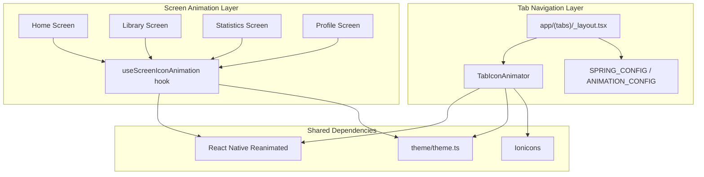
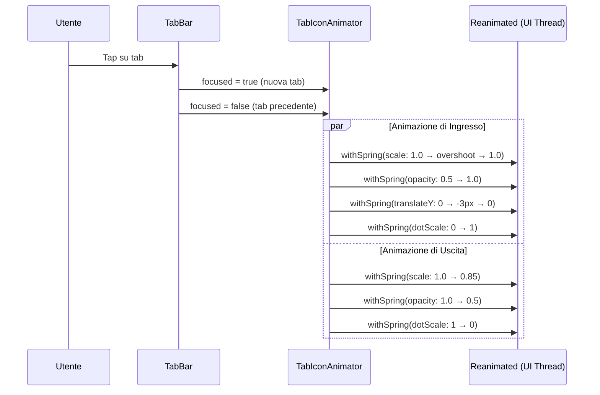
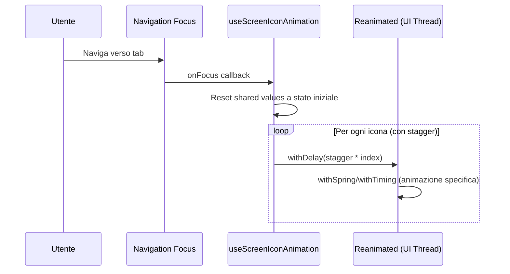

# Design: Premium Tab Animations

## Panoramica

Questa feature introduce un sistema di animazioni premium per la navigazione a tab dell'app Progressive Workout. L'implementazione si articola in due aree principali:

1. **Animazioni della Tab Bar**: Le icone nella barra di navigazione inferiore si animano con effetti di scala, opacità, bounce verticale e transizione filled/outline quando l'utente cambia tab. Un indicatore dot animato evidenzia la tab attiva.

2. **Animazioni di ingresso nelle schermate**: Ogni schermata tab (Home, Library, Statistics, Profile) presenta animazioni di ingresso uniche per le icone principali, con effetti diversificati (pulsazione, rotazione, bounce, slide-in) e stagger progressivo.

Tutte le animazioni utilizzano React Native Reanimated con esecuzione sul thread UI nativo per garantire fluidità a 60fps. Il sistema si integra con il tema esistente (`theme/theme.ts`) e il codice del layout tab viene refactorizzato in componenti dedicati e riutilizzabili.

### Decisioni di design chiave

- **Reanimated vs Animated API**: Si utilizza React Native Reanimated (già presente nel progetto via `SwipeableListItem`) invece dell'Animated API nativa di React Native (usata attualmente in `AnimatedCard`, `StatisticsScreen`). Reanimated offre esecuzione worklet sul thread UI, evitando il bridge JS e garantendo animazioni fluide anche sotto carico.
- **Componente dedicato `TabIconAnimator`**: Estratto in un file separato per separazione delle responsabilità e riutilizzabilità, seguendo il pattern architetturale del progetto.
- **Hook `useScreenIconAnimation`**: Un custom hook riutilizzabile per le animazioni di ingresso delle icone nelle schermate, che gestisce reset e replay automatico al focus della tab.
- **Spring Config condivisa**: Una configurazione spring esportabile come costante, coerente tra tab bar e schermate.

## Architettura



### Flusso delle animazioni Tab Bar



### Flusso delle animazioni di schermata



## Componenti e Interfacce

### 1. `TabIconAnimator` (nuovo componente)

**File**: `components/common/TabIconAnimator.tsx`

Componente che gestisce l'animazione completa di una singola icona nella tab bar.

```typescript
interface TabIconAnimatorProps {
  /** Nome dell'icona Ionicons (variante base senza -outline) */
  icon: TabIconName
  /** Colore dell'icona (gestito da Tabs) */
  color: string
  /** Se la tab è attualmente selezionata */
  focused: boolean
  /** Dimensione dell'icona (default: 24) */
  size?: number
}
```

**Responsabilità**:

- Gestisce shared values per scale, opacity, translateY, dotScale, dotOpacity
- Usa `useAnimatedStyle` per applicare trasformazioni senza re-render
- Transizione automatica tra icona filled (attiva) e outline (inattiva)
- Renderizza l'indicatore dot sotto l'icona

**Animazioni gestite**:
| Proprietà | Ingresso (focused=true) | Uscita (focused=false) |
|-----------|------------------------|----------------------|
| scale | 1.0 → ~1.15 → 1.0 (spring overshoot) | 1.0 → 0.85 |
| opacity | 0.5 → 1.0 | 1.0 → 0.5 |
| translateY | 0 → -3px → 0 (spring) | → 0 |
| dotScale | 0 → 1 | 1 → 0 |
| dotOpacity | 0 → 1 | 1 → 0 |

### 2. `useScreenIconAnimation` (nuovo hook)

**File**: `hooks/useScreenIconAnimation.ts`

Hook riutilizzabile per gestire le animazioni di ingresso delle icone nelle schermate tab.

```typescript
type AnimationType =
  | 'pulse' // scala 0→1.15→1.0
  | 'rotate' // rotazione + fade-in
  | 'bounceY' // bounce verticale + fade-in
  | 'slideX' // slide orizzontale + fade-in
  | 'spin' // rotazione 360° + scala
  | 'spinPartial' // rotazione parziale + scala
  | 'springScale' // scala spring con overshoot
  | 'bounceDrop' // bounce dall'alto + scala
  | 'clockwise' // rotazione oraria continua

interface IconAnimationConfig {
  type: AnimationType
  duration?: number
  delay?: number
}

interface UseScreenIconAnimationOptions {
  /** Configurazione per ogni icona da animare */
  icons: IconAnimationConfig[]
  /** Ritardo stagger tra icone successive (default: 80ms) */
  staggerDelay?: number
}

interface UseScreenIconAnimationReturn {
  /** Array di animated styles, uno per ogni icona configurata */
  animatedStyles: AnimatedStyleResult[]
  /** Funzione per riavviare le animazioni (chiamata al focus) */
  replay: () => void
}
```

**Responsabilità**:

- Crea shared values per ogni icona configurata
- Gestisce reset e replay al focus della tab (via `useFocusEffect` di expo-router)
- Applica il ritardo stagger progressivo
- Restituisce animated styles pronti da applicare ai wrapper `Animated.View`

### 3. Costanti di configurazione

**File**: `components/common/TabIconAnimator.tsx` (esportate)

```typescript
/** Configurazione spring condivisa per tutte le animazioni tab */
export const TAB_SPRING_CONFIG = {
  damping: 12,
  stiffness: 150,
  mass: 0.8
}

/** Configurazione delle tab con icone */
export const TAB_CONFIG = [
  { name: 'index', title: 'Home', icon: 'home' },
  { name: 'library', title: 'Library', icon: 'library' },
  { name: 'progress', title: 'Statistics', icon: 'stats-chart' },
  { name: 'profile', title: 'Profile', icon: 'person' }
] as const

/** Dimensioni e parametri animazione */
export const ANIMATION_PARAMS = {
  iconSize: 24,
  activeScale: 1.0,
  inactiveScale: 0.85,
  activeOpacity: 1.0,
  inactiveOpacity: 0.5,
  bounceY: -3,
  dotSize: 4
} as const
```

### 4. Layout Tab aggiornato

**File**: `app/(tabs)/_layout.tsx`

Il layout viene semplificato importando `TabIconAnimator` e le costanti dal componente dedicato. La logica di rendering delle icone viene delegata interamente a `TabIconAnimator`.

```typescript
// Struttura semplificata del layout
export default function TabLayout() {
  // ... auth logic invariata ...

  return (
    <Tabs screenOptions={{...}}>
      {TAB_CONFIG.map(({ name, title, icon }) => (
        <Tabs.Screen
          key={name}
          name={name}
          options={{
            title,
            tabBarIcon: ({ color, focused }) => (
              <TabIconAnimator icon={icon} color={color} focused={focused} />
            ),
          }}
          listeners={tabPressListener}
        />
      ))}
    </Tabs>
  );
}
```

## Modelli Dati

Questa feature non introduce nuovi modelli dati persistenti. Le strutture dati coinvolte sono esclusivamente in-memory e riguardano lo stato delle animazioni:

### Shared Values (Reanimated)

Per ogni `TabIconAnimator`:

```typescript
{
  scale: SharedValue<number> // 0.85 - 1.15
  opacity: SharedValue<number> // 0.5 - 1.0
  translateY: SharedValue<number> // -3 - 0
  dotScale: SharedValue<number> // 0 - 1
  dotOpacity: SharedValue<number> // 0 - 1
}
```

Per ogni icona di schermata (via `useScreenIconAnimation`):

```typescript
{
  scale: SharedValue<number>
  opacity: SharedValue<number>
  translateY: SharedValue<number>
  translateX: SharedValue<number>
  rotate: SharedValue<number> // in gradi
}
```

### Configurazione animazioni per schermata

Ogni schermata definisce la propria configurazione di animazioni come array di `IconAnimationConfig`:

| Schermata  | Icona   | Tipo Animazione | Durata | Stagger |
| ---------- | ------- | --------------- | ------ | ------- |
| Home       | play    | pulse           | 500ms  | 0ms     |
| Home       | fitness | rotate          | 400ms  | 80ms    |
| Home       | flame   | bounceY         | 450ms  | 160ms   |
| Home       | grid    | slideX          | 400ms  | 240ms   |
| Library    | scan    | spin            | 500ms  | 0ms     |
| Library    | add     | spinPartial     | 400ms  | 100ms   |
| Statistics | fitness | pulse (bounce)  | 500ms  | 0ms     |
| Statistics | flame   | bounceY         | 450ms  | 80ms    |
| Statistics | barbell | spin            | 500ms  | 160ms   |
| Statistics | time    | clockwise       | 600ms  | 240ms   |
| Profile    | barbell | springScale     | 600ms  | 0ms     |
| Profile    | fitness | slideX          | 400ms  | 200ms   |
| Profile    | time    | rotate          | 400ms  | 300ms   |
| Profile    | trophy  | bounceDrop      | 500ms  | 400ms   |

## Proprietà di Correttezza

_Una proprietà è una caratteristica o un comportamento che deve essere vero in tutte le esecuzioni valide di un sistema — essenzialmente, una dichiarazione formale su ciò che il sistema deve fare. Le proprietà fungono da ponte tra specifiche leggibili dall'uomo e garanzie di correttezza verificabili dalla macchina._

Le proprietà seguenti derivano dall'analisi dei criteri di accettazione. Molti criteri specifici per singola tab (3.1-3.4, 9.1-12.4) sono stati consolidati in proprietà universali che coprono tutti i casi.

### Proprietà 1: Valori target dello stato attivo

_Per qualsiasi_ tab e qualsiasi configurazione di icona, quando la tab diventa attiva (focused=true), i valori target dell'animazione devono essere: scale=1.0, opacity=1.0, translateY=0, dotScale=1, dotOpacity=1.

**Valida: Requisiti 1.1, 1.3, 2.1, 4.1**

### Proprietà 2: Valori target dello stato inattivo

_Per qualsiasi_ tab e qualsiasi configurazione di icona, quando la tab diventa inattiva (focused=false), i valori target dell'animazione devono essere: scale=0.85, opacity=0.5, translateY=0, dotScale=0, dotOpacity=0.

**Valida: Requisiti 1.2, 1.4, 2.2, 4.2**

### Proprietà 3: Mapping icone filled/outline

_Per qualsiasi_ tab nella configurazione TAB_CONFIG, quando focused=true il nome dell'icona deve essere il nome base (es. "home"), e quando focused=false il nome deve essere il nome base con suffisso "-outline" (es. "home-outline").

**Valida: Requisiti 3.1, 3.2, 3.3, 3.4**

### Proprietà 4: Idempotenza dello stato finale dopo selezioni rapide

_Per qualsiasi_ sequenza di cambiamenti rapidi di focus tra tab, lo stato finale delle animazioni deve corrispondere esclusivamente all'ultima tab selezionata come attiva e a tutte le altre come inattive, senza accumulo di stati intermedi.

**Valida: Requisiti 5.5**

### Proprietà 5: Calcolo del ritardo stagger

_Per qualsiasi_ schermata con N icone animate e un valore di stagger delay S, il ritardo dell'icona all'indice i deve essere uguale a i \* S (o al delay custom specificato nella configurazione). Il ritardo totale dell'ultima icona più la sua durata non deve superare il budget temporale della schermata.

**Valida: Requisiti 9.5, 10.3, 11.5, 12.5**

### Proprietà 6: Replay delle animazioni al re-focus

_Per qualsiasi_ schermata tab già visitata, quando l'utente naviga nuovamente verso di essa, tutti i shared values delle icone animate devono essere resettati ai valori iniziali e le animazioni devono essere rieseguite producendo lo stesso risultato finale della prima visita.

**Valida: Requisiti 13.1**

### Proprietà 7: Budget temporale totale delle animazioni

_Per qualsiasi_ configurazione di animazioni di una schermata, la somma del ritardo dell'ultima icona più la sua durata di animazione non deve superare 800ms.

**Valida: Requisiti 13.3**

### Proprietà 8: Animazioni attendono il completamento del caricamento

_Per qualsiasi_ schermata con dati in caricamento (loading=true), le animazioni delle icone non devono avviarsi fino a quando il caricamento non è completato (loading=false).

**Valida: Requisiti 13.4**

## Gestione Errori

### Animazioni Tab Bar

| Scenario                               | Comportamento                                                                                                            |
| -------------------------------------- | ------------------------------------------------------------------------------------------------------------------------ |
| Reanimated non disponibile             | Fallback a rendering statico senza animazioni (icone visibili, nessuna transizione)                                      |
| Spring config invalida                 | Utilizzo di valori default hardcoded (damping: 12, stiffness: 150, mass: 0.8)                                            |
| Cambio tab durante animazione in corso | L'animazione corrente viene interrotta e sostituita dalla nuova (comportamento nativo di `withSpring` con shared values) |
| Icona non trovata in Ionicons          | Rendering di un placeholder vuoto con le stesse dimensioni per evitare layout shift                                      |

### Animazioni di Schermata

| Scenario                               | Comportamento                                                                                             |
| -------------------------------------- | --------------------------------------------------------------------------------------------------------- |
| Focus event non ricevuto               | Le icone vengono renderizzate nello stato finale (scale=1, opacity=1) senza animazione                    |
| Dati in caricamento prolungato         | Le animazioni attendono, ma se il caricamento supera 3 secondi, le icone vengono mostrate staticamente    |
| Componente smontato durante animazione | I shared values di Reanimated gestiscono automaticamente il cleanup; nessuna azione aggiuntiva necessaria |
| Configurazione animazione mancante     | L'icona viene renderizzata staticamente senza animazione                                                  |

### Compatibilità Cross-Platform

| Scenario                      | Comportamento                                                                            |
| ----------------------------- | ---------------------------------------------------------------------------------------- |
| Platform.OS non riconosciuto  | Utilizzo dei valori di padding Android come default                                      |
| Haptics non disponibile (web) | Il feedback aptico viene silenziosamente ignorato (già gestito da `haptics.tabSwitch()`) |

## Strategia di Testing

### Approccio Duale

La feature richiede sia unit test che property-based test per una copertura completa:

- **Unit test**: Verificano esempi specifici, configurazioni, edge case e valori di stile
- **Property test**: Verificano proprietà universali che devono valere per tutti gli input

### Libreria Property-Based Testing

- **fast-check** (già configurato nel progetto con Vitest)
- Ogni property test deve eseguire minimo 100 iterazioni
- Ogni test deve essere taggato con un commento che referenzia la proprietà del design

### Unit Test

| Area              | Test                                           | Tipo                |
| ----------------- | ---------------------------------------------- | ------------------- |
| TabIconAnimator   | Dot ha colore theme.colors.primary             | Esempio (4.3, 8.1)  |
| TabIconAnimator   | Dot ha dimensioni 4x4px con border-radius full | Esempio (4.4)       |
| TabIconAnimator   | Colore inattivo è theme.colors.muted           | Esempio (8.2)       |
| TabIconAnimator   | Label usa theme.fonts.medium                   | Esempio (8.4)       |
| TabIconAnimator   | TAB_SPRING_CONFIG è esportata                  | Esempio (7.2)       |
| Tab Layout        | Padding iOS = 24px, Android = 8px              | Esempio (6.2)       |
| Home Screen       | Icona play ha animazione pulse 500ms           | Esempio (9.1)       |
| Home Screen       | Icona fitness ha animazione rotate 400ms       | Esempio (9.2)       |
| Home Screen       | Icona flame ha animazione bounceY 450ms        | Esempio (9.3)       |
| Home Screen       | Icona grid ha animazione slideX 400ms          | Esempio (9.4)       |
| Library Screen    | Icona scan ha animazione spin 500ms            | Esempio (10.1)      |
| Library Screen    | Icona add ha animazione spinPartial 400ms      | Esempio (10.2)      |
| Statistics Screen | Icone stat hanno animazioni corrette           | Esempio (11.1-11.4) |
| Profile Screen    | Icone profile hanno animazioni corrette        | Esempio (12.1-12.4) |

### Property-Based Test

Ogni proprietà di correttezza viene implementata da un singolo property-based test:

| Property | Tag                                                                             | Descrizione                                                                      |
| -------- | ------------------------------------------------------------------------------- | -------------------------------------------------------------------------------- |
| P1       | `Feature: premium-tab-animations, Property 1: Active state animation targets`   | Genera tab random, verifica target values con focused=true                       |
| P2       | `Feature: premium-tab-animations, Property 2: Inactive state animation targets` | Genera tab random, verifica target values con focused=false                      |
| P3       | `Feature: premium-tab-animations, Property 3: Icon name filled/outline mapping` | Genera nomi icona random dalla config, verifica suffisso -outline                |
| P4       | `Feature: premium-tab-animations, Property 4: Rapid selection final state`      | Genera sequenze random di cambi focus, verifica stato finale                     |
| P5       | `Feature: premium-tab-animations, Property 5: Stagger delay calculation`        | Genera N icone e stagger delay S, verifica delay[i] = i \* S                     |
| P6       | `Feature: premium-tab-animations, Property 6: Replay on re-focus`               | Genera sequenze di focus/unfocus, verifica reset e replay                        |
| P7       | `Feature: premium-tab-animations, Property 7: Total animation time budget`      | Genera configurazioni random di icone con durate e stagger, verifica ≤ 800ms     |
| P8       | `Feature: premium-tab-animations, Property 8: Animations wait for loading`      | Genera stati loading random, verifica che animazioni non partano durante loading |

### Struttura File Test

```
__tests__/
  components/
    TabIconAnimator.test.ts          # Unit test per il componente
    TabIconAnimator.property.test.ts  # Property test per P1-P4
  hooks/
    useScreenIconAnimation.test.ts          # Unit test per il hook
    useScreenIconAnimation.property.test.ts  # Property test per P5-P8
```

### Configurazione

```typescript
// Esempio di property test con fast-check
import * as fc from 'fast-check'

// Feature: premium-tab-animations, Property 3: Icon name filled/outline mapping
test('icon name mapping follows filled/outline convention', () => {
  fc.assert(
    fc.property(
      fc.constantFrom(...TAB_CONFIG.map(t => t.icon)),
      fc.boolean(),
      (iconBase, focused) => {
        const result = getIconName(iconBase, focused)
        if (focused) {
          expect(result).toBe(iconBase)
        } else {
          expect(result).toBe(`${iconBase}-outline`)
        }
      }
    ),
    { numRuns: 100 }
  )
})
```
