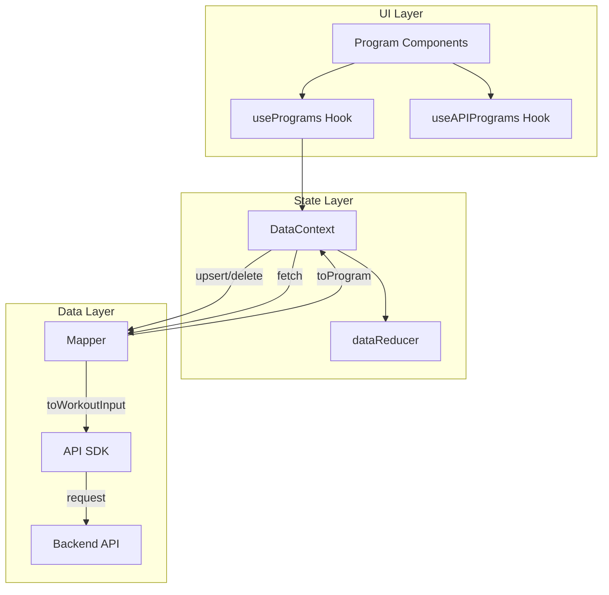

# Design Document: Program API Integration

## Overview

This feature bridges the frontend Program model with the backend Workout API by adding three layers:

1. **API SDK functions** — Typed CRUD functions for the `/api/v1/workouts` endpoints, added to the existing `lib/api.ts` module following the exercise function pattern.
2. **Data Mapper** — A pure function module (`lib/mappers/workout.ts`) that handles bidirectional conversion between the API Workout model and the frontend Program model, accounting for structural differences in blocks, warmup, durations, and metadata.
3. **DataContext integration** — Updates to `context/DataContext.tsx` to fetch, create, update, and delete programs via the API, mirroring the existing exercise API integration pattern.

Key design decisions driven by the real API response:

- `durations` is always present in the API response (e.g. `[0]`), so the mapper treats all-zero arrays as "no duration"
- `challengeConfig` is not yet supported by the backend; the mapper is forward-compatible (passes it through if present)
- The `?expand=blocks.exercise` query param embeds exercise objects in blocks; the mapper strips these for frontend use
- API blocks have no `type` field; the mapper always sets `type: 'exercise'`
- No local storage fallback or migrations needed — old data can be deleted

## Architecture



The data flow for a program save operation:

1. UI calls `actions.upsertProgram(programInput)`
2. DataContext converts Program → WorkoutCreateInput via `programToWorkoutInput()` mapper
3. API SDK sends the WorkoutCreateInput to `POST/PUT /api/v1/workouts`
4. API response (Workout) is converted back via `workoutToProgram()` mapper
5. Merged into state alongside seed programs

For fetching:

1. DataContext calls `fetchWorkouts()` from API SDK
2. Each Workout response is converted to Program via `workoutToProgram()`
3. API programs are merged with seed programs (API takes precedence by ID)

The API is the sole source of truth for user-created programs. If the API is unavailable, user program CRUD operations fail and propagate errors to the UI.

## Components and Interfaces

### API Types (lib/api.ts)

New types and exports added to the existing API module:

```typescript
// Expanded exercise object (from ?expand=blocks.exercise)
export interface APIExercise {
  id: string
  name: string
  source: string
  createdAt: string
  updatedAt: string
  category?: string
  icon?: string
  createdBy?: string
}

export interface APIWorkoutBlock {
  exerciseId: string
  reps: number[]
  rests: number[]
  durations: number[] // Always present in API response (e.g. [0])
  note?: string
  exercise?: APIExercise // Present when using ?expand=blocks.exercise
}

export interface APIWorkout {
  id: string
  name: string
  description?: string
  blocks: APIWorkoutBlock[]
  source: 'builtin' | 'user' | 'pt'
  initialWarmup: number
  defaultRestBetweenExercises: number
  createdBy?: string | Record<string, unknown>
  createdAt: string
  updatedAt: string
  deletedAt?: string
  challengeConfig?: Record<string, unknown> // Forward-compatible, not yet supported by backend
}

// Create/update input — only fields the backend accepts
export type APIWorkoutCreateInput = {
  name: string
  description?: string
  blocks: Omit<APIWorkoutBlock, 'exercise'>[] // No expanded exercise
  initialWarmup: number
  defaultRestBetweenExercises: number
}
```

// CRUD functions
export async function fetchWorkouts(): Promise<APIWorkout[]>
export async function fetchWorkout(id: string): Promise<APIWorkout>
export async function createWorkout(workout: APIWorkoutCreateInput): Promise<APIWorkout>
export async function updateWorkout(id: string, workout: APIWorkoutCreateInput): Promise<APIWorkout>
export async function deleteWorkout(id: string): Promise<void>

````

### Data Mapper (lib/mappers/workout.ts)

Pure functions for bidirectional conversion:

```typescript
import type { APIWorkout, APIWorkoutBlock, APIWorkoutCreateInput } from '@/lib/api'
import type { Program, ProgramBlock } from '@/types/program'

// API → Frontend
export function workoutBlockToProgram(block: APIWorkoutBlock): ProgramBlock
export function workoutToProgram(workout: APIWorkout): Program

// Frontend → API
export function programBlockToWorkout(block: ProgramBlock): Omit<APIWorkoutBlock, 'exercise'>
export function programToWorkoutInput(program: Program): APIWorkoutCreateInput
````

**Block mapping logic (API → Frontend):**

- `reps[]` → `targetReps`: single-element array becomes a number, multi-element stays as array, empty array becomes undefined
- `reps.length` → `sets`: defaults to 1 if reps is empty
- `rests[0]` → `restBetweenSets`: defaults to 60 if rests is empty
- `durations[]` → `durationSeconds`: first non-zero element if any exist, otherwise undefined. `[0]` and `[0, 0, 0]` both map to undefined.
- `note` → `note`: passed through
- `type` is always set to `'exercise'` (API blocks have no type field)
- `exercise` (expanded) is stripped — not included in ProgramBlock

**Block mapping logic (Frontend → API):**

- `targetReps` → `reps[]`: number is expanded to array of length `sets` (default 1), array is used as-is, undefined becomes `[]`
- `restBetweenSets` → `rests[]`: array of length `max(0, sets - 1)` filled with `restBetweenSets` (default 60)
- `durationSeconds` → `durations[]`: expanded to array of length `sets` if present, empty array `[]` if undefined
- `note` → `note`: passed through

**Top-level mapping (API → Frontend):**

- `initialWarmup` (number) → `initialWarmup` (`{ seconds: number }`) — 0 maps to undefined
- `challengeConfig` → `challengeConfig`: passed through if present (cast to `ChallengeConfig`), undefined if absent
- `createdBy`, `deletedAt` are dropped
- All other fields (`id`, `name`, `description`, `source`, `defaultRestBetweenExercises`, `createdAt`, `updatedAt`) pass through

**Top-level mapping (Frontend → API create/update input):**

- `initialWarmup?.seconds` → `initialWarmup` (number) — undefined maps to 0
- Only includes: `name`, `description`, `blocks`, `initialWarmup`, `defaultRestBetweenExercises`
- Excludes: `id`, `source`, `challengeConfig`, `createdBy`, `createdAt`, `updatedAt`, `deletedAt`

### useAPIPrograms Hook (hooks/data/useAPIPrograms.ts)

```typescript
export interface UseAPIProgramsState {
  data: Program[]
  loading: boolean
  error: APIError | null
  isAPIAvailable: boolean
}

export function useAPIPrograms(): UseAPIProgramsState
```

Follows the exact same pattern as `useAPIExercises`:

- `useState` + `useEffect` with mounted guard
- Calls `fetchWorkouts()` then maps each result via `workoutToProgram()`
- Sets `APIError` with `API_DISABLED` code if API is not available

### DataContext Updates (context/DataContext.tsx)

Changes to the existing DataContext:

1. **Program loading** (`useEffect` on mount): Add API fetch branch mirroring the exercise loading pattern
   - If user is authenticated and API is available, call `fetchWorkouts()` and map results
   - Merge API programs with seed programs (API takes precedence by ID)
   - If API is unavailable or user is not authenticated, only load seed programs

2. **`upsertProgram` action**: Add API save path
   - Convert input to Workout format via `programToWorkoutInput()`
   - Call `createWorkout()` or `updateWorkout()` based on whether ID exists in API
   - Convert response back via `workoutToProgram()`
   - Propagate errors to the caller

3. **`deleteProgram` action**: Add API delete path
   - Call `deleteWorkout(id)` if user is authenticated and API is available
   - Propagate errors to the caller

4. **`refreshAll` action**: Add API re-fetch for programs (mirroring exercise refresh)

## Data Models

### API Workout Block (Backend — real response)

```typescript
{
  exerciseId: string       // Required
  reps: number[]           // Required — e.g., [12, 10, 8] for 3 sets
  rests: number[]          // Required — e.g., [60, 60] for rest between sets
  durations: number[]      // Always present — e.g., [0] when no timed work
  note?: string            // Optional
  exercise?: {             // Present with ?expand=blocks.exercise
    id: string
    name: string
    source: string
    createdAt: string
    updatedAt: string
    category?: string
    icon?: string
    createdBy?: string
  }
}
```

### Program Block (Frontend)

```typescript
{
  type: 'exercise'                    // Always 'exercise'
  exerciseId: string                  // Required
  targetReps?: number | number[]      // Optional — single number or per-set array
  sets?: number                       // Defaults to 1
  restBetweenSets?: number            // Defaults to 60
  durationSeconds?: number            // Optional — single value
  note?: string                       // Optional
}
```

### Mapping Examples

| Frontend Program Block                                      | API Workout Block                                               |
| ----------------------------------------------------------- | --------------------------------------------------------------- |
| `{ targetReps: 12, sets: 3, restBetweenSets: 60 }`          | `{ reps: [12, 12, 12], rests: [60, 60], durations: [0, 0, 0] }` |
| `{ targetReps: [12, 10, 8], sets: 3, restBetweenSets: 90 }` | `{ reps: [12, 10, 8], rests: [90, 90], durations: [0, 0, 0] }`  |
| `{ targetReps: undefined, sets: 1 }`                        | `{ reps: [], rests: [], durations: [] }`                        |
| `{ durationSeconds: 30, sets: 2 }`                          | `{ reps: [], rests: [60], durations: [30, 30] }`                |

### Durations Edge Cases

| API `durations` | Frontend `durationSeconds` |
| --------------- | -------------------------- |
| `[0]`           | `undefined`                |
| `[0, 0, 0]`     | `undefined`                |
| `[30]`          | `30`                       |
| `[30, 30, 30]`  | `30`                       |
| `[]`            | `undefined`                |
| `[0, 30, 0]`    | `30` (first non-zero)      |

### Warmup Mapping

| Frontend                          | API                  |
| --------------------------------- | -------------------- |
| `initialWarmup: { seconds: 180 }` | `initialWarmup: 180` |
| `initialWarmup: undefined`        | `initialWarmup: 0`   |
| `initialWarmup: { seconds: 0 }`   | `initialWarmup: 0`   |

## Correctness Properties

_A property is a characteristic or behavior that should hold true across all valid executions of a system — essentially, a formal statement about what the system should do. Properties serve as the bridge between human-readable specifications and machine-verifiable correctness guarantees._

The mapper is the core correctness concern in this feature. The API SDK functions and DataContext integration are integration-level concerns best validated with example-based tests. The mapper operates on structured data with clear invariants ideal for property-based testing.

### Property 1: Program round-trip consistency

_For any_ valid Program (with arbitrary blocks, warmup, rest settings, and optional durations), converting it to a WorkoutCreateInput via `programToWorkoutInput` and then back to a Program via `workoutToProgram` (with synthetic id/createdAt/updatedAt/source) SHALL produce a Program equivalent to the original (after normalizing: single-number targetReps expanded to arrays when sets > 1, and durationSeconds=undefined producing durations=[0,...] which maps back to undefined).

**Validates: Requirements 3.1, 2.5, 2.6, 2.9**

### Property 2: API block to Program block field correctness

_For any_ valid APIWorkoutBlock (with arbitrary reps, rests, durations arrays), converting it via `workoutBlockToProgram` SHALL produce a ProgramBlock where:

- `type` is always `'exercise'`
- `sets` equals `reps.length` (or 1 if reps is empty)
- `targetReps` is a single number when reps has one element, an array when reps has multiple elements, or undefined when reps is empty
- `restBetweenSets` equals `rests[0]` (or 60 when rests is empty)
- `durationSeconds` equals the first non-zero element of `durations` when one exists, or undefined when all values are zero or the array is empty
- The expanded `exercise` field is not present in the output

**Validates: Requirements 2.1, 2.2, 2.3, 2.4, 2.10, 2.12**

### Property 3: Program block to API block field correctness

_For any_ valid ProgramBlock (with arbitrary targetReps, sets, restBetweenSets, durationSeconds), converting it via `programBlockToWorkout` SHALL produce an APIWorkoutBlock where:

- `reps` has length equal to `sets` (default 1), filled with the targetReps value (expanded if single number)
- `rests` has length equal to `max(0, sets - 1)`, filled with `restBetweenSets` (default 60)
- `durations` has length equal to `sets` when `durationSeconds` is defined (filled with that value), or is an empty array when undefined
- No `exercise` field is present in the output

**Validates: Requirements 2.7, 2.8, 2.11, 7.3**

### Property 4: Create/update input excludes server-managed fields

_For any_ valid Program, converting it via `programToWorkoutInput` SHALL produce an object that contains only `name`, `description`, `blocks`, `initialWarmup`, and `defaultRestBetweenExercises` — and does not contain `id`, `source`, `challengeConfig`, `createdBy`, `createdAt`, `updatedAt`, or `deletedAt`.

**Validates: Requirements 7.1, 7.2**

## Error Handling

Error handling follows the existing patterns in `lib/api.ts`:

| Scenario                    | Error Code                     | Behavior                                    |
| --------------------------- | ------------------------------ | ------------------------------------------- |
| User not authenticated      | `NO_AUTH`                      | Thrown by `getAuthToken()` before request   |
| API disabled/not configured | `API_DISABLED`                 | Thrown by `request()`, propagated to caller |
| Network failure             | `NETWORK_ERROR`                | Thrown by `request()`, propagated to caller |
| HTTP 404                    | `HTTP_ERROR` (statusCode: 404) | Thrown by `request()`                       |
| HTTP 4xx/5xx                | `HTTP_ERROR` (statusCode: N)   | Thrown by `request()`                       |
| Request timeout             | `TIMEOUT`                      | Thrown by `request()`, propagated to caller |
| Token refresh failure       | `TOKEN_ERROR`                  | Thrown by `getAuthToken()`                  |

The DataContext does not fall back to local storage for program operations. API errors are propagated to the caller so the UI can display appropriate error feedback. Program loading on mount will catch API errors and log them, loading only seed programs in that case.

The `useAPIPrograms` hook exposes the error state so consuming components can display error UI.

## Testing Strategy

### Property-Based Tests (fast-check)

Property-based tests target the mapper layer. Using `fast-check` (already in the project via Vitest):

- **Minimum 100 iterations** per property test
- Each test tagged with: `Feature: program-api-integration, Property N: {title}`
- Test file: `__tests__/lib/mappers/workout.property.test.ts`

Generators needed:

- `arbitraryProgramBlock()` — generates valid ProgramBlock with random targetReps (number, number[], or undefined), sets (1-10), restBetweenSets (10-300), durationSeconds (optional 10-600), note (optional string)
- `arbitraryProgram()` — generates valid Program with 1-5 random blocks, optional warmup, optional defaultRestBetweenExercises, optional challengeConfig
- `arbitraryAPIWorkoutBlock()` — generates valid APIWorkoutBlock with random reps array (0-10 elements), rests array, durations array (including all-zeros case), optional expanded exercise object
- `arbitraryAPIWorkout()` — generates valid APIWorkout with random blocks, optional challengeConfig

### Unit Tests (Vitest)

Unit tests cover specific examples, edge cases, and integration points:

- **Mapper edge cases** (`__tests__/lib/mappers/workout.test.ts`):
  - Empty reps array → undefined targetReps, sets=1
  - Single-element reps → number targetReps
  - targetReps single number with sets > 1 → expanded reps array
  - Warmup 0 → undefined initialWarmup on round-trip
  - `durations: [0]` → durationSeconds undefined
  - `durations: [0, 0, 0]` → durationSeconds undefined
  - `durations: [0, 30, 0]` → durationSeconds 30 (first non-zero)
  - Expanded exercise field stripped from block output
  - challengeConfig passed through when present, undefined when absent
  - Missing optional fields (description, note)

- **API SDK functions** (`__tests__/lib/api.workout.test.ts`):
  - Each CRUD function sends correct HTTP method and endpoint
  - Auth token is included in headers
  - Error responses produce correct APIError codes

- **DataContext integration** (`__tests__/context/DataContext.program.test.ts`):
  - upsertProgram calls API when available, propagates errors on failure
  - deleteProgram calls API when available, propagates errors on failure
  - Program loading merges API + seed programs correctly

### Test Configuration

- Property-based testing library: `fast-check` (via Vitest)
- Each property test runs minimum 100 iterations
- Tag format: `Feature: program-api-integration, Property {number}: {property_text}`
