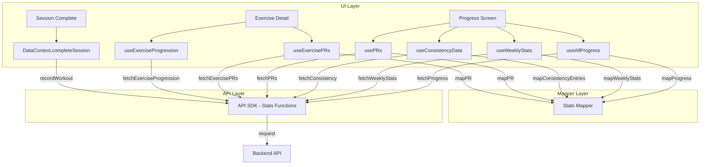

# Design Document: Stats API Integration

## Overview

This feature replaces all local storage-based progress tracking with backend Stats API calls. It adds three layers:

1. **API SDK functions** — Typed functions for the 7 stats endpoints (`/api/v1/stats/*`), added to the existing `lib/api.ts` module following the exercise/workout function pattern.
2. **Stats Mapper** — A pure function module (`lib/mappers/stats.ts`) that converts between API response shapes and frontend types, handling field differences (e.g., `activeWorkouts` vs `activePrograms`/`activeChallenges`, PR field stripping, `prsAchieved` omission).
3. **Hook migration** — Updates to all progress-related hooks (`useAllProgress`, `usePRs`, `useExercisePRs`, `useWeeklyStats`, `useConsistencyData`, `useExerciseProgression`, `useExercisesWithProgression`) to fetch from the API instead of local storage.
4. **Session completion update** — The `DataContext.completeSession` flow is updated to POST workout data to the backend via `recordWorkout`, which returns detected PRs. Local PR detection logic is removed.
5. **Type alignment** — Frontend types (`AggregatedProgress`, `WeeklyStats`) are updated to match API response shapes.
6. **Local storage cleanup** — All progress-related storage functions are removed.

Key design decisions:

- The mapper is intentionally thin — most API responses closely match frontend types, so mapping is mostly field renaming/dropping rather than structural transformation.
- The consistency heatmap hook retains its local grid-building logic (generating weeks/days structure) but sources raw data from the API instead of local storage.
- The `useExerciseProgression` hook retains its local trend calculation logic since the API returns raw data points, not computed trends.
- No local storage fallback — if the API is unavailable, hooks return an error state.

## Architecture



Data flow for recording a workout:

1. UI calls `actions.completeSession(slug, sessionIndex, summary, timeSpentSeconds)`
2. DataContext collects exercise data from session events (sets, reps, weights, timestamps)
3. DataContext constructs a `WorkoutLogInput` and calls `recordWorkout(input)` via API SDK
4. Backend persists the workout log, detects PRs, and returns `{ workoutLog, newPRs }`
5. DataContext increments `progressVersion` so all dependent hooks re-fetch
6. New PRs from the response are made available for UI display (e.g., PR celebration modal)

Data flow for reading stats:

1. Hook mounts and calls the appropriate API SDK function (e.g., `fetchProgress()`)
2. API SDK makes authenticated request to backend
3. Response is mapped via Stats Mapper to frontend type
4. Hook returns `{ data, loading, error }` to the UI component

The API is the sole source of truth for all progress data. If the API is unavailable, hooks set an `APIError` with code `API_DISABLED`.

## Components and Interfaces

### API Types (lib/api.ts)

New types added to the existing API module:

```typescript
// ─── Stats API Types ──────────────────────────────────────────────────────────

/** Input for recording a completed workout */
export interface WorkoutLogInput {
  workoutId: string
  completedAt: string // ISO datetime
  timeSpentSeconds: number // minimum 1
  exercises: WorkoutLogExerciseInput[]
}

export interface WorkoutLogExerciseInput {
  exerciseId: string
  sets: WorkoutLogSetInput[] // minItems 1
  lastCompletedAt: string // ISO datetime
}

export interface WorkoutLogSetInput {
  reps: number
  weight?: number // minimum 0
  isBodyweight: boolean
  timestamp: string // ISO datetime
}

/** Response from recording a workout */
export interface WorkoutLogResponse {
  workoutLog: {
    id: string
    userId: string
    workoutId: string
    completedAt: string
    timeSpentSeconds: number
    exercises: WorkoutLogExerciseResult[]
  }
  newPRs: NewPREntry[]
}

export interface WorkoutLogExerciseResult {
  exerciseId: string
  repsCompleted: number
  setsCompleted: number
  sets: WorkoutLogSetInput[]
  totalVolume: number
  lastCompletedAt: string
}

export interface NewPREntry {
  exerciseId: string
  type: 'max_weight' | 'max_reps' | 'max_volume' | 'estimated_1rm'
  value: number
  previousValue?: number
}

/** Personal record from API */
export interface APIPR {
  id: string
  userId: string
  exerciseId: string
  type: 'max_weight' | 'max_reps' | 'max_volume' | 'estimated_1rm'
  value: number
  achievedAt: string // ISO datetime
  workoutId?: string
  details?: { weight?: number; reps?: number }
  isCurrent: boolean
}

/** Aggregated progress from API */
export interface APIProgress {
  totalWorkoutsCompleted: number
  totalTimeSpentSeconds: number
  totalRepsCompleted: number
  activeWorkouts: number
  currentStreak: number
  recentActivity: { date: string; workoutId: string }[]
  exercisesWithData: string[]
}

/** Weekly stats from API */
export interface APIWeeklyStats {
  weekStart: string
  weekEnd: string
  workoutsCompleted: number
  workoutGoal: number
  totalTimeSeconds: number
  totalVolume: number
  totalReps: number
  exercisesPerformed: string[]
  currentStreak: number
}

/** Consistency heatmap entry from API */
export interface ConsistencyEntry {
  date: string
  workoutCount: number
}

/** Exercise progression data point from API */
export interface ProgressionPoint {
  date: string
  reps: number
  maxWeight?: number
  volume?: number
}
```

### API SDK Functions (lib/api.ts)

New functions added to the existing API module:

```typescript
// ─── Stats API Functions ──────────────────────────────────────────────────────

export async function recordWorkout(
  input: WorkoutLogInput
): Promise<WorkoutLogResponse>
export async function fetchPRs(limit?: number): Promise<APIPR[]>
export async function fetchExercisePRs(
  exerciseId: string,
  current?: boolean
): Promise<APIPR[]>
export async function fetchProgress(): Promise<APIProgress>
export async function fetchWeeklyStats(
  weekStart?: string
): Promise<APIWeeklyStats>
export async function fetchConsistency(
  weeks?: number
): Promise<ConsistencyEntry[]>
export async function fetchExerciseProgression(
  exerciseId: string,
  days?: number
): Promise<ProgressionPoint[]>
```

All functions use the existing `request<T>()` helper with Firebase auth tokens.

### Stats Mapper (lib/mappers/stats.ts)

Pure functions for converting API responses to frontend types:

```typescript
import type {
  APIPR,
  APIProgress,
  APIWeeklyStats,
  ConsistencyEntry
} from '@/lib/api'
import type { PersonalRecord } from '@/types'
import type { AggregatedProgress } from '@/hooks/data/useAllProgress'
import type { WeeklyStats } from '@/types'

/** Convert API PR to frontend PersonalRecord (drops userId, isCurrent) */
export function mapPR(apiPR: APIPR): PersonalRecord

/** Convert API progress to frontend AggregatedProgress */
export function mapProgress(apiProgress: APIProgress): AggregatedProgress

/** Convert API weekly stats to frontend WeeklyStats */
export function mapWeeklyStats(apiWeekly: APIWeeklyStats): WeeklyStats

/** Convert consistency entries to a Map<date, workoutCount> */
export function mapConsistencyEntries(
  entries: ConsistencyEntry[]
): Map<string, number>
```

**Mapping details:**

`mapPR(apiPR)`:

- Maps `id`, `exerciseId`, `type`, `value`, `achievedAt`, `workoutId`, `details` directly
- Drops `userId` and `isCurrent`

`mapProgress(apiProgress)`:

- Maps `totalWorkoutsCompleted`, `totalTimeSpentSeconds`, `totalRepsCompleted`, `currentStreak` directly
- Maps `activeWorkouts` to `activeWorkouts` (single field replacing `activePrograms`/`activeChallenges`)
- Maps `recentActivity` as-is (both API and updated frontend use `{ date, workoutId }`)
- Maps `exercisesWithData` directly

`mapWeeklyStats(apiWeekly)`:

- Maps all fields directly: `weekStart`, `weekEnd`, `workoutsCompleted`, `workoutGoal`, `totalTimeSeconds`, `totalVolume`, `totalReps`, `exercisesPerformed`, `currentStreak`
- Does NOT include `prsAchieved` (removed from frontend type)

`mapConsistencyEntries(entries)`:

- Converts array of `{ date, workoutCount }` to `Map<string, number>`
- Only includes entries with `workoutCount >= 1` (API already filters this)

### Hook Updates

Each hook follows the same migration pattern:

1. Replace `storage.*` call with the corresponding API SDK function
2. Apply Stats Mapper to convert response to frontend type
3. Keep existing `useAsyncData` / `useState+useEffect` pattern
4. Keep `progressVersion` dependency for re-fetching after workout recording

**useAllProgress** — calls `fetchProgress()`, maps via `mapProgress()`
**usePRs** — calls `fetchPRs(limit)`, maps each via `mapPR()`, builds `prsByExercise` and `bestPRs` maps from the mapped results
**useExercisePRs** — calls `fetchExercisePRs(exerciseId, true)` for current PRs, maps via `mapPR()`
**useWeeklyStats** — calls `fetchWeeklyStats(weekStart)`, maps via `mapWeeklyStats()`
**useConsistencyData** — calls `fetchConsistency(weeks)`, maps via `mapConsistencyEntries()`, then builds the `WeekData[]` grid structure locally (same grid logic, different data source)
**useExerciseProgression** — calls `fetchExerciseProgression(exerciseId, days)`, uses response directly as `ProgressionDataPoint[]`, keeps local `calculateTrend()` logic
**useExercisesWithProgression** — calls `fetchProgress()`, returns `exercisesWithData` field directly

### DataContext Updates

**`completeSession` action:**

1. Collect exercise data from session events (same as current logic)
2. Construct `WorkoutLogInput` with `workoutId`, `completedAt`, `timeSpentSeconds`, and `exercises` array
3. Call `recordWorkout(input)` via API SDK
4. Store `newPRs` from response for UI display
5. Increment `progressVersion` to trigger hook re-fetches
6. Remove local PR detection (`storage.detectAndSavePRs`) and local progress saving (`storage.saveProgramProgress`, `storage.saveChallengeProgress`)

**New state field:**

- Add `lastNewPRs: NewPREntry[]` to DataState for UI access to newly detected PRs after workout recording

## Data Models

### WorkoutLogInput (POST /api/v1/stats/workouts request)

```typescript
{
  workoutId: string          // Program or challenge ID
  completedAt: string        // ISO datetime
  timeSpentSeconds: number   // Duration (minimum 1)
  exercises: [
    {
      exerciseId: string
      sets: [
        {
          reps: number
          weight?: number      // For weighted exercises
          isBodyweight: boolean
          timestamp: string    // ISO datetime
        }
      ]
      lastCompletedAt: string  // ISO datetime
    }
  ]
}
```

### WorkoutLogResponse (POST /api/v1/stats/workouts response)

```typescript
{
  workoutLog: {
    id: string
    userId: string
    workoutId: string
    completedAt: string
    timeSpentSeconds: number
    exercises: [
      {
        exerciseId: string
        repsCompleted: number
        setsCompleted: number
        sets: [{ reps, weight?, isBodyweight, timestamp }]
        totalVolume: number
        lastCompletedAt: string
      }
    ]
  }
  newPRs: [
    {
      exerciseId: string
      type: 'max_weight' | 'max_reps' | 'max_volume' | 'estimated_1rm'
      value: number
      previousValue?: number
    }
  ]
}
```

### API PR → Frontend PersonalRecord Mapping

| API Field    | Frontend Field | Notes                  |
| ------------ | -------------- | ---------------------- |
| `id`         | `id`           | Direct pass-through    |
| `userId`     | —              | Dropped                |
| `exerciseId` | `exerciseId`   | Direct pass-through    |
| `type`       | `type`         | Same enum values       |
| `value`      | `value`        | Direct pass-through    |
| `achievedAt` | `achievedAt`   | Direct pass-through    |
| `workoutId`  | `workoutId`    | Optional, pass-through |
| `details`    | `details`      | Optional, pass-through |
| `isCurrent`  | —              | Dropped                |

### API Progress → Frontend AggregatedProgress Mapping

| API Field                | Frontend Field           | Notes                                        |
| ------------------------ | ------------------------ | -------------------------------------------- |
| `totalWorkoutsCompleted` | `totalWorkoutsCompleted` | Direct                                       |
| `totalTimeSpentSeconds`  | `totalTimeSpentSeconds`  | Direct                                       |
| `totalRepsCompleted`     | `totalRepsCompleted`     | Direct                                       |
| `activeWorkouts`         | `activeWorkouts`         | Replaces `activePrograms`/`activeChallenges` |
| `currentStreak`          | `currentStreak`          | Direct                                       |
| `recentActivity`         | `recentActivity`         | Both use `{ date, workoutId }`               |
| `exercisesWithData`      | `exercisesWithData`      | Direct                                       |

### API Weekly → Frontend WeeklyStats Mapping

| API Field            | Frontend Field       | Notes                      |
| -------------------- | -------------------- | -------------------------- |
| `weekStart`          | `weekStart`          | Direct                     |
| `weekEnd`            | `weekEnd`            | Direct                     |
| `workoutsCompleted`  | `workoutsCompleted`  | Direct                     |
| `workoutGoal`        | `workoutGoal`        | Direct                     |
| `totalTimeSeconds`   | `totalTimeSeconds`   | Direct                     |
| `totalVolume`        | `totalVolume`        | Direct                     |
| `totalReps`          | `totalReps`          | Direct                     |
| `exercisesPerformed` | `exercisesPerformed` | Direct                     |
| `currentStreak`      | `currentStreak`      | Direct                     |
| —                    | ~~`prsAchieved`~~    | Removed from frontend type |

## Correctness Properties

_A property is a characteristic or behavior that should hold true across all valid executions of a system — essentially, a formal statement about what the system should do. Properties serve as the bridge between human-readable specifications and machine-verifiable correctness guarantees._

The mapper layer is the primary correctness concern in this feature. The API SDK functions are thin wrappers around `request<T>()` and are best validated with example-based integration tests. The mapper functions operate on structured data with clear invariants, making them ideal for property-based testing.

### Property 1: PR mapping preserves required fields and drops server-only fields

_For any_ valid APIPR object (with arbitrary `id`, `userId`, `exerciseId`, `type`, `value`, `achievedAt`, `workoutId`, `details`, and `isCurrent`), converting it via `mapPR` SHALL produce a `PersonalRecord` where:

- `id`, `exerciseId`, `type`, `value`, `achievedAt` match the input
- `workoutId` matches the input when present
- `details` matches the input when present
- The output does NOT contain `userId` or `isCurrent` fields

**Validates: Requirements 2.1**

### Property 2: Progress mapping preserves all fields and maps activeWorkouts

_For any_ valid APIProgress object (with arbitrary `totalWorkoutsCompleted`, `totalTimeSpentSeconds`, `totalRepsCompleted`, `activeWorkouts`, `currentStreak`, `recentActivity` array, and `exercisesWithData` array), converting it via `mapProgress` SHALL produce an `AggregatedProgress` where:

- `totalWorkoutsCompleted`, `totalTimeSpentSeconds`, `totalRepsCompleted`, `currentStreak` match the input
- `activeWorkouts` equals the input `activeWorkouts`
- `recentActivity` has the same length and each entry's `date` and `workoutId` match the input
- `exercisesWithData` matches the input array

**Validates: Requirements 2.2, 2.3**

### Property 3: Weekly stats mapping preserves all shared fields

_For any_ valid APIWeeklyStats object (with arbitrary `weekStart`, `weekEnd`, `workoutsCompleted`, `workoutGoal`, `totalTimeSeconds`, `totalVolume`, `totalReps`, `exercisesPerformed` array, and `currentStreak`), converting it via `mapWeeklyStats` SHALL produce a `WeeklyStats` where:

- All shared fields match the input values
- The output does NOT contain a `prsAchieved` field

**Validates: Requirements 2.4**

### Property 4: Consistency entry mapping round-trip

_For any_ list of ConsistencyEntry objects (with unique `date` strings and `workoutCount >= 1`), converting via `mapConsistencyEntries` SHALL produce a `Map<string, number>` where:

- The map has the same number of entries as the input list
- For each input entry, `map.get(entry.date)` equals `entry.workoutCount`
- For each key in the map, there exists a corresponding entry in the input list

**Validates: Requirements 2.5**

### Property 5: WorkoutLogInput construction includes all required fields

_For any_ set of session exercise data (with arbitrary exerciseIds, sets with reps/weights/timestamps), constructing a `WorkoutLogInput` SHALL produce an object where:

- `workoutId` is a non-empty string
- `completedAt` is a valid ISO datetime string
- `timeSpentSeconds` is a positive number
- `exercises` is a non-empty array where each entry has a non-empty `exerciseId`, a non-empty `sets` array, and a valid `lastCompletedAt` datetime
- Each set in each exercise has `reps` (number), `isBodyweight` (boolean), and `timestamp` (string)

**Validates: Requirements 3.3**

## Error Handling

Error handling follows the existing patterns in `lib/api.ts`. All stats API functions use the same `request<T>()` helper, so error handling is consistent:

| Scenario                    | Error Code                   | Behavior                                    |
| --------------------------- | ---------------------------- | ------------------------------------------- |
| User not authenticated      | `NO_AUTH`                    | Thrown by `getAuthToken()` before request   |
| API disabled/not configured | `API_DISABLED`               | Thrown by `request()`, propagated to caller |
| Network failure             | `NETWORK_ERROR`              | Thrown by `request()`, propagated to caller |
| HTTP 4xx/5xx                | `HTTP_ERROR` (statusCode: N) | Thrown by `request()`                       |
| Request timeout             | `TIMEOUT`                    | Thrown by `request()`, propagated to caller |
| Token refresh failure       | `TOKEN_ERROR`                | Thrown by `getAuthToken()`                  |

**Hook error handling:**

- Each hook catches errors from API calls and exposes them via the `error` return field
- If the API is not available (`isAPIAvailable()` returns false), hooks set an `APIError` with code `API_DISABLED`
- The `useAsyncData` pattern already handles mounted guards to prevent state updates after unmount

**Session completion error handling:**

- If `recordWorkout` fails, the error is propagated to the caller (the session completion UI)
- The UI can display an error message and optionally retry
- No local fallback — the workout data is not silently dropped

## Testing Strategy

### Property-Based Tests (fast-check)

Property-based tests target the mapper layer. Using `fast-check` (already in the project via Vitest):

- Minimum 100 iterations per property test
- Each test tagged with: `Feature: stats-api-integration, Property N: {title}`
- Test file: `__tests__/lib/mappers/stats.property.test.ts`

Generators needed:

- `arbitraryAPIPR()` — generates valid APIPR with random id, userId, exerciseId, type (one of the 4 PR types), value, achievedAt (ISO datetime), optional workoutId, optional details, isCurrent boolean
- `arbitraryAPIProgress()` — generates valid APIProgress with random totals, activeWorkouts, currentStreak, recentActivity array (0-20 entries with date and workoutId), exercisesWithData array (0-10 exercise IDs)
- `arbitraryAPIWeeklyStats()` — generates valid APIWeeklyStats with random weekStart/weekEnd dates, counts, arrays
- `arbitraryConsistencyEntry()` — generates valid ConsistencyEntry with random date string and workoutCount >= 1
- `arbitrarySessionExerciseData()` — generates valid exercise data for WorkoutLogInput construction

### Unit Tests (Vitest)

Unit tests cover specific examples, edge cases, and integration points:

- **Mapper edge cases** (`__tests__/lib/mappers/stats.test.ts`):
  - mapPR with missing optional fields (no workoutId, no details)
  - mapPR with all fields present
  - mapProgress with empty recentActivity and exercisesWithData arrays
  - mapProgress with activeWorkouts = 0
  - mapWeeklyStats with all zero values
  - mapConsistencyEntries with empty array → empty Map
  - mapConsistencyEntries with single entry

- **API SDK functions** (`__tests__/lib/api.stats.test.ts`):
  - Each function sends correct HTTP method, endpoint, and query params
  - recordWorkout sends correct POST body
  - fetchPRs includes limit query param when provided
  - fetchExercisePRs includes exerciseId in path and current query param
  - fetchConsistency includes weeks query param
  - fetchExerciseProgression includes exerciseId in path and days query param

- **DataContext integration** (`__tests__/context/DataContext.stats.test.ts`):
  - completeSession constructs correct WorkoutLogInput from session events
  - completeSession stores newPRs from response
  - completeSession increments progressVersion on success
  - completeSession propagates error on API failure

### Test Configuration

- Property-based testing library: `fast-check` (via Vitest)
- Each property test runs minimum 100 iterations
- Tag format: `Feature: stats-api-integration, Property {number}: {property_text}`
