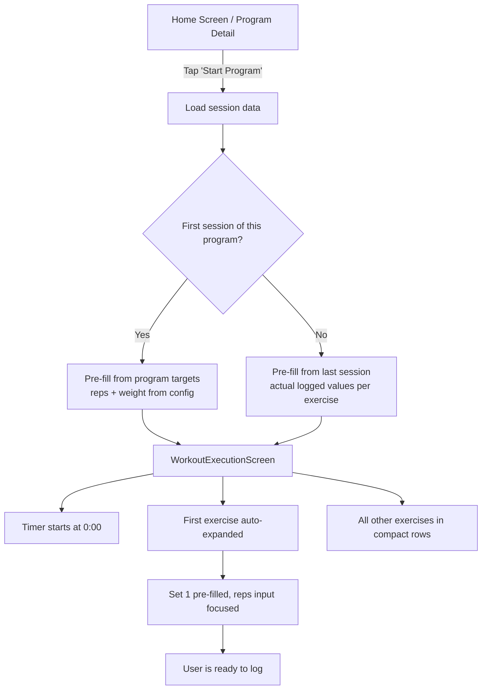
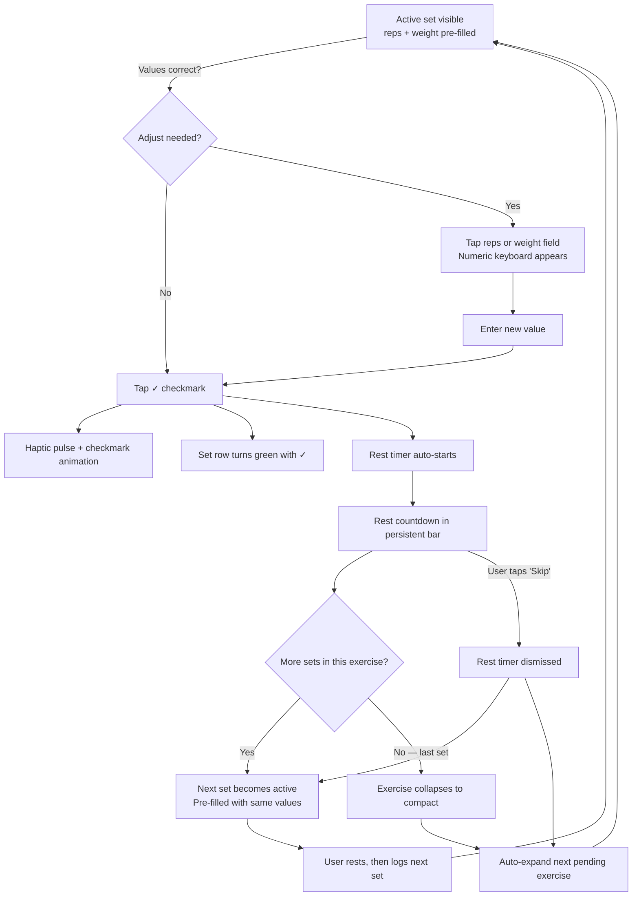
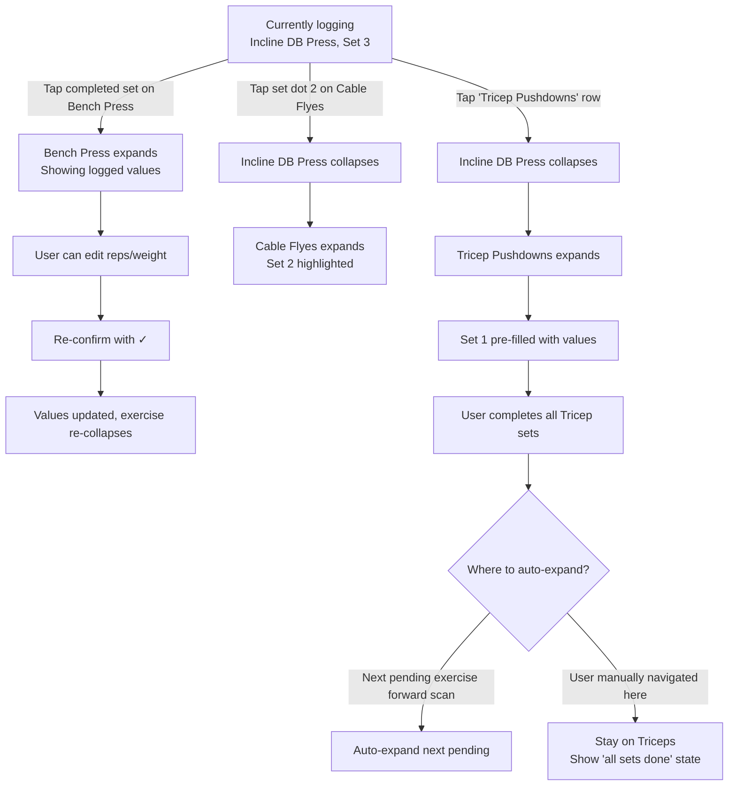
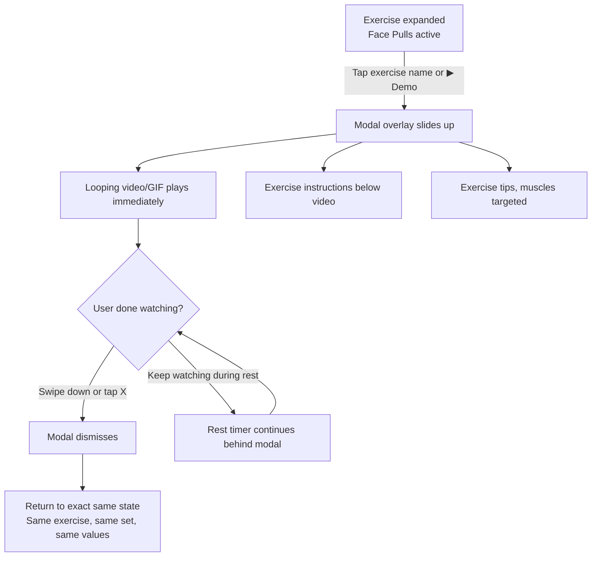
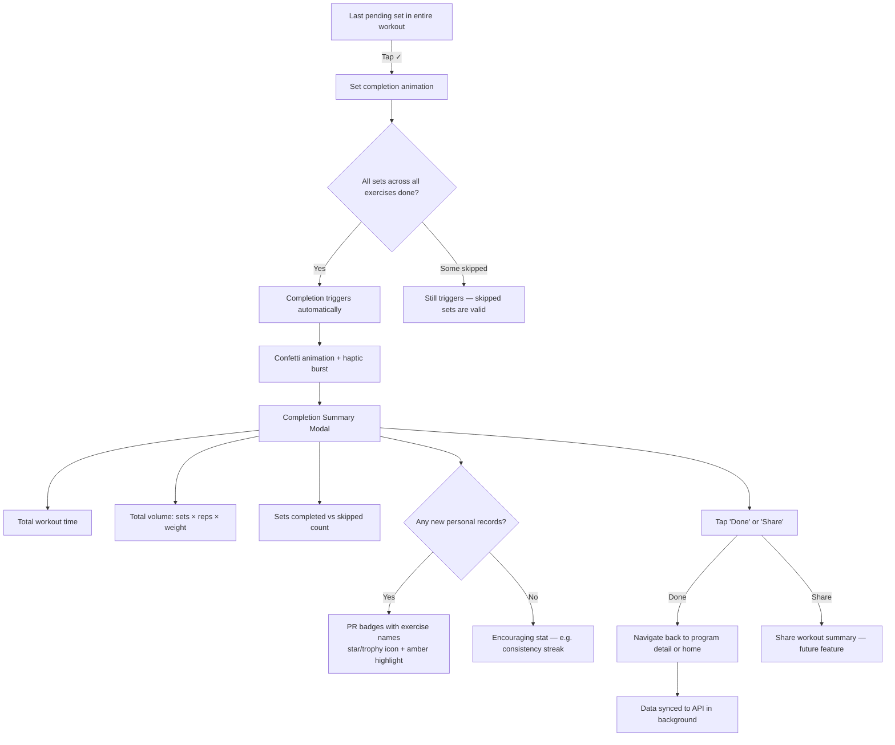
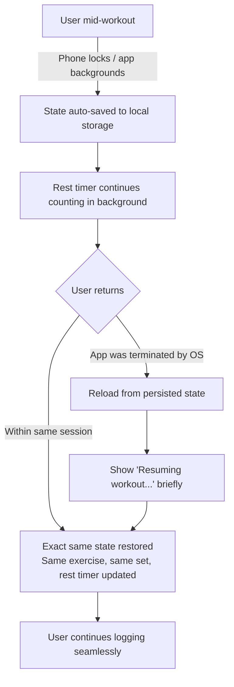

# UX Design Specification pwo

**Author:** Nocfer
**Date:** 2026-03-06

---

## Executive Summary

### Scope

This UX specification covers the **WorkoutExecutionScreen redesign** and **exercise media integration** — the core v1.2 deliverables. The design system (colors, typography, spacing) defined here is app-wide and will be applied to all existing screens via the rebuilt `theme.ts`, but layout and interaction redesigns are scoped exclusively to the workout execution flow. Other screens (Home, Program Detail, Program Editor, Exercise Library, Progress) receive the dark theme restyle automatically through token updates — no layout changes required.

### Project Vision

PWO v1.2 is a workout experience overhaul for a cross-platform fitness tracker (iOS, Android, Web). The core transformation shifts the workout execution screen from a rigid, timer-driven flow to a Hevy-inspired, user-paced set logging approach. Users log sets at their own pace with optional rest timers, while exercise media demonstrations become accessible one tap away during workouts. The goal is to make workout logging feel faster than writing in a notes app — under 5 seconds per set.

### Target Users

**Primary Segment:** Anyone who goes to the gym and wants to log workouts without friction — from beginners learning movements to experienced lifters running structured programs.

- **"The Experienced Regular" (Marco, 28):** Gym 3-5x/week, structured programs, wants fast logging and automatic PR tracking. Values speed and minimal UI noise. Will rarely use exercise demos.
- **"The Growing Lifter" (Ana, 23):** Gym 2-3x/week, still learning form, needs exercise media demos during workouts. Has abandoned complex and basic apps alike. Values guidance without condescension.

**Shared Needs:** Fast, invisible logging. Progress visibility over time. An interface that feels simple for all skill levels. Cross-platform availability.

**Usage Context:** Mid-workout at the gym — sweaty hands, between sets, variable lighting, phone propped on a bench or held in one hand. Interactions happen in 5-15 second windows between sets.

### Key Design Challenges

1. **Gym-environment usability:** Large tap targets, forgiving inputs, minimal precision required. Every interaction competes with fatigue, sweat, and time pressure.
2. **Simplicity vs. depth balance:** The same screen must feel approachable for beginners and efficient for experienced lifters. Progressive disclosure is essential.
3. **Media integration without disruption:** Exercise demos must be discoverable for users who need them and invisible for those who don't. One tap away, never in the way.
4. **Cross-platform interaction parity:** Touch and mouse/keyboard interactions must both feel native. Swipe, tap targets, and media playback differ across platforms.
5. **Monolith decomposition shapes UX:** Breaking the 1256-line screen into composable components means the UX component hierarchy must be well-defined upfront to guide the code architecture.

### Design Opportunities

1. **"Invisible logging" as competitive moat:** Achieving <5 second set logging makes PWO genuinely faster than a notes app — the bar most gym-goers currently use.
2. **In-context media as market differentiator:** No major competitor integrates form demonstrations into the active workout flow. This directly serves the growing-lifter persona.
3. **Progressive disclosure via exercise detail screen:** The main logging surface stays radically clean; all depth (instructions, media, notes, exercise history) lives one tap away. This pattern scales to future features without bloating the core experience.

## Core User Experience

### Defining Experience

The core interaction in PWO is **logging a set**: entering reps, entering weight, and checking it off. This atomic action happens 15-40+ times per workout session and must complete in under 5 seconds. Every design decision is evaluated against this speed target.

The secondary interaction is **navigating between exercises** within the workout. PWO uses a **matrix-driven approach**: a persistent, compact exercise list (the WorkoutMatrix) shows all exercises with inline set indicators. The active exercise expands to reveal logging controls, providing both a full workout overview and focused logging in one view. This is not a horizontal swipe model — it's a smart accordion where context and focus coexist.

### Platform Strategy

**Primary platform: Mobile (iOS, Android via Expo)**

- 95%+ of workout logging happens on mobile, phone held in one hand or propped on a bench
- Touch-first design: large tap targets (minimum 44pt), one-hand reachable controls, forgiving input areas
- Leverage device capabilities: haptic feedback on set completion, auto-advancing input focus

**Secondary platform: Web**

- Used for reviewing workouts, browsing exercise library, managing programs
- Less likely used mid-workout, but must maintain full feature parity
- Mouse/keyboard interactions must feel native (tab between inputs, enter to confirm)

**Offline behavior:**

- Set logging is local-first — all input and state changes happen instantly on device
- Background sync to API when connected
- Exercise media (video/GIF) requires network; show graceful placeholder when offline

### Effortless Interactions

1. **Smart set pre-population:** First session of a program uses the program's target reps and weight. All subsequent sessions pre-fill from the user's last logged values for that exercise. For most sets, the user just taps the checkmark — zero typing required.

2. **Auto-advancing rest timer:** After checking off a set, a rest timer automatically starts counting down (using the program's `restBetweenSets` value). The timer is visible but non-blocking — the user can dismiss it, adjust the duration, or simply ignore it and log the next set whenever ready. The timer never prevents interaction.

3. **Matrix-driven navigation:** The WorkoutMatrix shows all exercises at a glance with set completion indicators. The active exercise is expanded with logging controls (reps input, weight input, checkmark). When the last set of an exercise is checked off, the next exercise automatically expands. Users can also tap any exercise row or set indicator to jump directly to it.

4. **One-tap media access:** Tapping the exercise name (or a subtle info icon) in the expanded exercise view opens the instruction/media screen as a modal overlay. The looping video/GIF plays immediately. Dismissing returns the user to exactly where they were — no state loss, no re-navigation.

5. **Resilient state persistence:** The workout state persists through app backgrounding, phone locks, and process termination. Users return to exactly where they left off. Session state is saved continuously, not just on explicit pause.

### Critical Success Moments

1. **First set logged:** The user sees their target reps and weight pre-filled, taps the checkmark, the set indicator turns green with a satisfying haptic pulse, and the rest timer appears. Thought: "oh, that was easy." If this moment fails, the user abandons the app.

2. **Form check mid-workout:** Between sets, the user taps the exercise name, sees a looping GIF of proper form with clear text instructions, and returns to logging with one tap. This is Ana's "aha moment" — form guidance exactly when needed, not buried in a library.

3. **Exercise transition:** The last set of an exercise is checked off. The rest timer starts, and when the user is ready, the next exercise smoothly expands in the matrix with pre-filled values. The transition feels like a natural progression, not a navigation event.

4. **Workout completion:** All sets checked off. A completion summary appears showing total time, volume, reps, and any new personal records — with celebration animation (confetti + haptics). This is the reward moment that reinforces the habit loop.

5. **Resume after interruption:** The user locked their phone to do a set, unlocked it 90 seconds later. The app is exactly where they left it — same exercise, same set, rest timer still counting (or finished). Zero re-navigation.

### Experience Principles

1. **Speed over features:** Every design decision is evaluated by "does this make set logging faster?" If a feature adds friction to the core logging loop, it waits for a future version.

2. **Pre-fill, don't ask:** Default to the expected values — target reps/weight on first session, last-logged values on subsequent sessions. The user confirms or adjusts, never starts from blank.

3. **Matrix as home base:** The WorkoutMatrix is always visible, providing context for where the user is in the workout. The active exercise expands inline with logging controls. The user never loses sight of their full workout.

4. **Depth on demand:** The logging surface is radically clean — reps, weight, checkmark. Instructions, media, notes, exercise history, and rest timer settings are all one tap away but never visible by default.

5. **Never lose state:** The workout persists through every interruption. Auto-save is continuous. The user never has to think about "saving" their workout until it's complete.

6. **Auto-start, manual-stop:** Rest timers start automatically after set completion. The user can dismiss, adjust, or ignore them. Automation serves the expected flow; manual override is always available.

## Desired Emotional Response

### Primary Emotional Goals

The overarching emotional target during workout execution is **flow state** — the interaction is so fast and natural that the app essentially disappears. The user is focused on their workout, not on the app. This is the emotional equivalent of the "invisible logging" principle.

**Core feelings to cultivate:**

- **Effortless control** — "I'm in charge of my workout, and the app just keeps up"
- **Micro-accomplishment** — Every checked-off set is a small win that builds momentum
- **Quiet confidence** — The user always knows where they are and what to do next
- **Earned pride** — Workout completion and PR moments are genuine rewards

### Emotional Journey Mapping

| Moment                 | Desired Emotion                    | Design Implication                                                  |
| ---------------------- | ---------------------------------- | ------------------------------------------------------------------- |
| Starting a workout     | Anticipation, readiness            | Clean entry point, immediate focus on first exercise                |
| Logging a set          | Micro-accomplishment, "effortless" | Haptic pulse, green checkmark animation, satisfying visual feedback |
| Between sets (resting) | Calm control                       | Non-intrusive auto-start rest timer, no pressure                    |
| Checking exercise form | Confidence, reassurance            | Clear looping media, concise instructions, easy return              |
| Exercise transition    | Smooth momentum                    | Auto-advance to next exercise, clear progress in matrix             |
| Hitting a new PR       | Surprise + pride                   | Instant notification, celebration micro-animation                   |
| Workout completion     | Accomplishment, pride              | Summary stats, confetti + haptics, time/volume/PRs                  |
| Returning next session | Familiarity, trust                 | Pre-filled values from last session, identical patterns             |
| Something goes wrong   | Reassurance, not panic             | "Your workout is saved" messaging, graceful recovery                |

### Micro-Emotions

**Cultivate:**

- **Confidence over confusion** — The matrix provides constant orientation. The user always knows where they are in the workout and what to do next.
- **Accomplishment over frustration** — The app amplifies small victories (set checkmarks, progress bar advancement) rather than highlighting what remains.
- **Trust over anxiety** — State persistence is invisible but absolute. The user never worries about losing data.
- **Focus over distraction** — The logging surface shows only what's needed right now. Depth is available but never imposed.

**Actively prevent:**

- **Interruption anxiety** — "Did my workout save?" should never cross the user's mind
- **Input frustration** — No fumbling with tiny inputs or unclear fields mid-workout
- **Overwhelm** — No walls of exercises, options, or data during execution
- **Patronized** — Guidance (media, instructions) feels like a knowledgeable friend, not a tutorial

### Design Implications

| Emotional Goal             | UX Design Approach                                                                     |
| -------------------------- | -------------------------------------------------------------------------------------- |
| Flow state / invisible app | Minimal chrome, pre-filled values, one-tap interactions, no modals blocking logging    |
| Micro-accomplishment       | Haptic feedback on set completion, checkmark animation, progress bar increments        |
| Confidence / orientation   | Persistent WorkoutMatrix showing full workout context, clear active exercise highlight |
| Calm control (rest)        | Auto-start timer that never blocks, dismiss/adjust always available, subtle countdown  |
| Surprise + pride (PRs)     | Inline PR badge on set completion when record broken, celebration on workout finish    |
| Trust / data safety        | Continuous auto-save, "workout saved" indicator, instant resume on app reopen          |
| No overwhelm               | One expanded exercise at a time, progressive disclosure for all secondary information  |
| No patronizing             | Media access is opt-in via exercise name tap, no tooltips or forced tutorials          |

### Emotional Design Principles

1. **Celebrate the small wins:** Every set completion gets tactile feedback (haptic + visual). Progress is always visible and advancing. The app makes the user feel productive.

2. **Calm, not urgent:** Rest timers count down but never flash, alarm, or create pressure. The app respects the user's pace. Urgency is the enemy of gym flow.

3. **Confidence through clarity:** The matrix always shows where you are. The active exercise is unambiguous. There is never a moment of "what do I do now?"

4. **Reward the finish:** Workout completion is the emotional peak — summary stats, personal records, celebration animation. This is the moment that brings users back tomorrow.

5. **Silent reliability:** The most important emotional design is what users DON'T feel — no anxiety about data loss, no confusion about navigation, no frustration with inputs. Absence of negative emotion is the foundation.

## UX Pattern Analysis & Inspiration

### Inspiring Products Analysis

**1. Hevy (Primary Reference)**

- **Core strength:** Set logging speed — pre-filled reps/weight from last session, tap checkmark to complete. Under 3 seconds for most sets.
- **Key patterns:** Inline reps/weight inputs per set row, rest timer auto-starts after set completion, exercise list is vertical with expandable exercises, drag to reorder exercises.
- **Emotional quality:** Feels fast and competent. No wasted space or unnecessary steps.

**2. Strong**

- **Core strength:** Visual clarity and restraint. Clean distinction between active and completed sets through typography hierarchy and whitespace.
- **Key patterns:** Minimalist set rows, subtle color coding for completion states, clear information hierarchy without decorative elements.
- **Emotional quality:** Feels professional and trustworthy. The simplicity builds confidence.

**3. Apple Fitness (Workout Rings)**

- **Core strength:** Progress celebration. Ring animations, haptic pulses on milestones, and glanceable data make every completion feel earned.
- **Key patterns:** Visual progress indicators that animate on completion, haptic confirmation tied to achievement moments, minimal interaction during active workout.
- **Emotional quality:** Feels rewarding and motivating. Progress is tangible and visceral.

### Transferable UX Patterns

**From Hevy — Adopt:**

- Pre-fill reps/weight from last session (the core speed pattern)
- Inline set row with reps input, weight input, checkmark — all in one row
- Rest timer auto-starts after set completion with configurable duration
- Checkmark tap as the primary completion gesture

**From Strong — Adopt:**

- Visual restraint: clean typography hierarchy over decorative elements
- Clear active vs. completed vs. pending state differentiation through subtle color and weight changes
- Generous whitespace in the logging area for gym-environment tap targets

**From Apple Fitness — Adapt:**

- Progress celebration adapted to set completion: haptic pulse + checkmark animation on each set, not just workout completion
- Progress bar advancement in the matrix header as a persistent motivation signal
- PR detection surfaced immediately on set completion (like ring closure celebration)

**Unique to PWO — Innovate:**

- Matrix-driven navigation: the WorkoutMatrix as persistent overview + accordion expansion for logging (neither Hevy nor Strong uses this pattern)
- In-context exercise media: one-tap access to looping video/GIF demos during active workout (no competitor does this)
- Smart pre-population with dual source: program targets for first session, last-logged values for subsequent sessions

### Anti-Patterns to Avoid

1. **JEFIT's cluttered execution screen:** Too many buttons, stats, and options visible during the workout. Overwhelms users and slows logging.
2. **Timer-driven forced flow (current PWO):** The existing PWO timer state machine forces users through warmup → exercise → rest in rigid sequence. Users should control their own pace.
3. **Hevy's full exercise scroll:** Showing all exercises in a long scrollable list loses orientation. The matrix approach keeps the full workout visible without scrolling.
4. **Modal overuse during logging:** Any modal that interrupts the set logging flow (confirmation dialogs, tooltips, forced tutorials) breaks flow state.
5. **Tiny input fields:** Fitness apps that use standard mobile text inputs for reps/weight ignore the gym context (sweaty hands, fatigue, one-handed use).

### Design Inspiration Strategy

**Adopt directly:**

- Hevy's pre-fill + confirm set logging pattern (the speed foundation)
- Hevy's auto-start rest timer behavior
- Strong's visual restraint and typography-first hierarchy
- Apple Fitness's haptic celebration on completion moments

**Adapt for PWO:**

- Hevy's expandable exercise list → PWO's matrix accordion (more compact, better orientation)
- Apple's ring progress → PWO's matrix progress bar + set indicator animations
- Strong's set row layout → PWO's set row with larger tap targets for gym environment

**Avoid entirely:**

- JEFIT's information density during active workout
- Forced sequential flow that removes user control
- Modal interruptions during the logging loop
- Small or precision-requiring input fields

## Design System Foundation

### Design System Choice

**Custom dark-first design system, rebuilt from scratch.** PWO uses a bespoke theme built with React Native StyleSheet and theme tokens — no external UI library. The existing `theme/theme.ts` will be completely replaced with a new dark, minimalistic system tuned for gym-environment usability.

**Why custom:** PWO already maintains a custom design system. The workout execution screen has unique interaction patterns (matrix-driven navigation, inline set logging, auto-start rest timers) that no off-the-shelf system addresses. Custom tokens give full control over the gym-optimized touch targets, dark contrast ratios, and phase-based color coding that define PWO's visual identity.

### Rationale for Selection

1. **Dark-first for gym environment:** Reduces eye strain between sets, saves battery on OLED devices, creates a focused, immersive feel during workouts. Dark themes are the standard in fitness apps (Hevy, most serious gym apps).
2. **DM Sans for personality:** Replaces Inter with DM Sans — a geometric sans-serif with slightly more character while remaining highly legible. Sporty without being aggressive. Requires loading all four weights: Regular (400), Medium (500), SemiBold (600), Bold (700).
3. **Indigo tuned for dark:** The existing indigo primary (#6366F1) is shifted to indigo-400 (#818CF8) for better contrast and vibrancy on dark surfaces.
4. **Minimalist visual philosophy:** Strip decoration, maximize whitespace, let typography and content carry the hierarchy. Every visual element must earn its place.

### Implementation Approach

The theme file (`theme/theme.ts`) is fully replaced. All existing components referencing theme tokens will need visual updates. The token structure (colors, fonts, spacing, radius, shadows, typography, presets) remains the same shape so the migration is mechanical — swap values, not architecture.

**Critical implementation steps:**

1. **Hardcoded color audit:** Before swapping the theme, grep all `.tsx` files for hardcoded hex values (`#`) that bypass the theme. Every hardcoded color becomes a contrast violation on dark backgrounds. These must be converted to theme tokens.
2. **`surfaceElevated` assignment:** This is a new token not in the current theme. Identify which components should use `surfaceElevated` vs `surface` — modals, expanded exercise areas, input backgrounds, and dropdown menus use `surfaceElevated`; cards and rows use `surface`.
3. **Shadow migration:** Current theme has 4 shadow levels used across many components and presets. Each shadow usage needs review — replace with color-based elevation (surface steps) or retain the single subtle `sm` shadow for floating elements only.
4. **Font loading update:** Update `app/_layout.tsx` to import DM Sans weights from `@expo-google-fonts/dm-sans` instead of Inter. Verify package is installed.
5. **Preset rebuild:** All preset objects (`presets.buttonPrimary`, `presets.card`, `presets.input`, etc.) must be rebuilt with dark values. Pay special attention to `presets.input` which needs `surfaceElevated` background.

**Recommendation:** Ship the theme migration as its own dedicated story/PR, separate from the WorkoutExecutionScreen redesign. Test every screen after the theme swap before building new features on top.

### Color Palette

**Core surfaces:**

| Token             | Value     | Role                                                         |
| ----------------- | --------- | ------------------------------------------------------------ |
| `background`      | `#0B0C10` | App base — deep charcoal, not pure black                     |
| `surface`         | `#14151A` | Cards, rows, elevated containers                             |
| `surfaceElevated` | `#1C1D24` | Modals, expanded areas, inputs, dropdowns                    |
| `text`            | `#ECEDF0` | Primary text — warm off-white                                |
| `textInverse`     | `#0B0C10` | Text on bright status fills (success, accent, danger badges) |
| `subtext`         | `#8C8EA0` | Secondary text, labels                                       |
| `muted`           | `#53556A` | Tertiary text, placeholders, disabled                        |
| `border`          | `#1F2029` | Subtle dividers and card edges                               |
| `borderLight`     | `#2A2B36` | Slightly more visible dividers                               |

**Brand colors:**

| Token           | Value                       | Role                                    |
| --------------- | --------------------------- | --------------------------------------- |
| `primary`       | `#818CF8`                   | Indigo-400 — tuned for dark backgrounds |
| `primaryDark`   | `#6366F1`                   | Pressed/active state                    |
| `primaryLight`  | `rgba(129, 140, 248, 0.12)` | Subtle indigo tint for active rows      |
| `primaryMuted`  | `rgba(129, 140, 248, 0.25)` | Indigo at 25% for badges/chips          |
| `primaryTextOn` | `#FFFFFF`                   | Text on primary color fills             |
| `accent`        | `#FBBF24`                   | Amber-400 — PRs, highlights, rewards    |
| `accentLight`   | `rgba(251, 191, 36, 0.12)`  | Subtle amber for backgrounds            |

**Status colors:**

| Token          | Value                       | Role                                   |
| -------------- | --------------------------- | -------------------------------------- |
| `success`      | `#34D399`                   | Emerald-400 — completed sets, positive |
| `successLight` | `rgba(52, 211, 153, 0.12)`  | Subtle green for completed rows        |
| `danger`       | `#F87171`                   | Red-400 — errors, destructive actions  |
| `dangerLight`  | `rgba(248, 113, 113, 0.12)` | Subtle red for error states            |
| `warning`      | `#FBBF24`                   | Amber-400                              |
| `warningLight` | `rgba(251, 191, 36, 0.12)`  | Subtle amber                           |

**Phase colors (workout states) — solid hex pre-computed against `surface` #14151A:**

| Token              | Value     | Role                                           |
| ------------------ | --------- | ---------------------------------------------- |
| `phases.warmup`    | `#FB923C` | Orange-400 — warmup phase accent               |
| `phases.warmupBg`  | `#1D1813` | Solid warmup row tint (orange 10% on surface)  |
| `phases.working`   | `#818CF8` | Indigo-400 — active exercise accent            |
| `phases.workingBg` | `#1B1B28` | Solid working row tint (indigo 10% on surface) |
| `phases.break`     | `#22D3EE` | Cyan-400 — rest/break accent                   |
| `phases.breakBg`   | `#151D20` | Solid break row tint (cyan 10% on surface)     |
| `phases.done`      | `#34D399` | Emerald-400 — completed accent                 |
| `phases.doneBg`    | `#161E1B` | Solid done row tint (emerald 10% on surface)   |

Note: Solid hex values guarantee identical rendering across iOS, Android, and Web. Avoid rgba for phase backgrounds due to inconsistent rendering with overlapping views on React Native.

**Utility colors:**

| Token               | Value                    | Role                                   |
| ------------------- | ------------------------ | -------------------------------------- |
| `overlay`           | `rgba(0, 0, 0, 0.6)`     | Modal/sheet backdrop                   |
| `overlayGlass`      | `rgba(20, 21, 26, 0.95)` | Frosted dark glass effect for overlays |
| `skeleton`          | `#1C1D24`                | Skeleton loader base                   |
| `skeletonHighlight` | `#2A2B36`                | Skeleton animation highlight           |

### Typography

**Font family: DM Sans** (replacing Inter)

Load all four weights: `DMSans_400Regular`, `DMSans_500Medium`, `DMSans_600SemiBold`, `DMSans_700Bold`

| Token      | Size | Weight         | Line Height | Letter Spacing |
| ---------- | ---- | -------------- | ----------- | -------------- |
| `display`  | 32   | Bold (700)     | 38          | -0.8           |
| `h1`       | 24   | SemiBold (600) | 30          | -0.5           |
| `h2`       | 18   | SemiBold (600) | 24          | -0.3           |
| `body`     | 16   | Regular (400)  | 24          | 0              |
| `bodyBold` | 16   | SemiBold (600) | 24          | 0              |
| `caption`  | 13   | Medium (500)   | 18          | 0.2            |
| `small`    | 11   | Medium (500)   | 14          | 0.3            |

`display` is new — used for workout timer, PR celebrations, and the workout completion screen. Base body size is 16 (up from 15) for gym-distance readability.

### Spacing

| Token | Value |
| ----- | ----- |
| `xs`  | 4     |
| `sm`  | 8     |
| `md`  | 12    |
| `lg`  | 16    |
| `xl`  | 24    |
| `xxl` | 40    |

`xxl` increased from 32 to 40 for more generous breathing room in the minimalist layout.

### Border Radius

| Token  | Value |
| ------ | ----- |
| `xs`   | 4     |
| `sm`   | 8     |
| `md`   | 12    |
| `lg`   | 16    |
| `xl`   | 20    |
| `full` | 9999  |

Sharper than the previous system — minimalism favors subtler curves.

### Elevation Strategy

Dark themes make traditional shadows invisible. Elevation is communicated through surface color steps:

- **Level 0:** `background` (#0B0C10) — app base
- **Level 1:** `surface` (#14151A) — cards, rows, matrix
- **Level 2:** `surfaceElevated` (#1C1D24) — modals, expanded exercise area, inputs

One subtle shadow (`sm`) retained for rare floating elements (FABs, tooltips). All other depth is color-based.

### Touch Target Strategy

Gym-environment minimum: **48pt tappable area** (meets Google Material 48dp guideline). Visual elements can be smaller (36-40pt) inside a 48pt touch target using padding. This is critical for:

- Set indicators in the WorkoutMatrix
- Reps/weight input fields
- Checkmark completion button
- Rest timer controls
- Exercise name tap (media access)

### Customization Strategy

**What changes from the existing theme:**

- All color values (light → dark palette)
- Font family (Inter → DM Sans, all 4 weights)
- Typography scale (8 steps → 7, with new `display` level, base size 15 → 16)
- Radius values (softer → sharper)
- Shadow strategy (4 levels → 1 + color-based elevation)
- `xxl` spacing increased (32 → 40)
- New tokens: `surfaceElevated`, `textInverse`, `overlayGlass` updated
- Phase backgrounds: rgba → solid hex

**What stays the same:**

- Token structure and naming convention
- StyleSheet-based approach (no CSS-in-JS library)
- Theme import pattern (`import { theme } from '@/theme/theme'`)
- Preset pattern for reusable style compositions

## Defining Experience

### The Core Interaction

**"See your last weight. Tap the check. Next set."**

The user glances at the pre-filled reps and weight from their last session, taps the checkmark, and the set is done. Rest timer starts. The whole workout is a rhythm of lift → check → rest → repeat. If a user described PWO to a gym partner: _"It already knows what I'm lifting. I just confirm each set."_

### User Mental Model

Gym-goers think of workouts as **a set of tasks, not a sequence.** They think: "I have 4 sets of bench at 225" — not "step 7 of 23." The WorkoutMatrix maps directly to this mental model: a visual checklist of exercises with set indicators.

The matrix supports **arbitrary navigation**: users can tap any set in any exercise to jump to it, complete exercises out of order, go back to edit a completed set, or skip ahead. The workout is not a linear flow — it's a collection of sets that can be completed in any order the user chooses.

**Where users solve this today:** Notes app, paper, or memory. PWO must be faster than typing "225x6" into a notes app.

### Success Criteria

1. A user can log a complete set (see pre-fill → tap checkmark) in under 5 seconds
2. A user can navigate to any set in any exercise with a single tap on the matrix
3. The workout is "done" when all sets are completed or explicitly skipped — regardless of completion order
4. Pre-filled values are always correct (last-logged for returning sessions, program targets for first session)
5. State persists through every interruption — app background, phone lock, process termination

### Non-Linear Navigation Model

The WorkoutMatrix supports fully arbitrary navigation. Users can complete sets in any order, jump between exercises freely, and revisit completed sets to edit them. The workout is a **set of tasks, not a sequence.**

**Navigation behaviors:**

| User Action                                                 | System Response                                                                                                              |
| ----------------------------------------------------------- | ---------------------------------------------------------------------------------------------------------------------------- |
| Tap pending set in different exercise                       | Collapse current exercise, expand tapped exercise with pre-filled values. Instant, no confirmation.                          |
| Tap completed set (green)                                   | Expand exercise showing that set's logged values. User can edit and re-confirm.                                              |
| Complete last set of an exercise                            | Auto-expand next pending exercise (forward scan from current, wrapping around). Previous exercise collapses to compact view. |
| Complete sets out of order (e.g., set 1, set 3, skip set 2) | Valid. Set 2 remains pending. Workout not complete until all sets are done or skipped.                                       |
| Navigate away while rest timer running                      | Rest timer continues in compact bar at top of screen. Timer is workout-level, not exercise-specific.                         |
| Complete all sets across all exercises                      | Workout completion triggers — regardless of order completed. Summary modal appears.                                          |
| "End Workout" with pending sets                             | Remaining pending sets marked as skipped. Completion summary shows completed vs skipped counts.                              |

**Auto-expand priority after set completion:**

1. Next pending set in the same exercise
2. If all sets done for this exercise → next pending exercise (forward scan, wrap around)
3. If user has manually navigated to a different exercise → respect their position, don't auto-jump back

**Pre-fill logic (consistent regardless of navigation order):**

- First session of a program: program's target reps and weight
- All subsequent sessions: last-logged values for that specific exercise from the most recent session
- Pre-fill is per-exercise, not per-position — same values regardless of which set or what order

### Novel UX Patterns

| Pattern                    | Source                           | PWO Innovation                                                                   |
| -------------------------- | -------------------------------- | -------------------------------------------------------------------------------- |
| Pre-fill from last session | Hevy (established)               | Dual-source: program targets first, then last-logged                             |
| Checkmark to complete      | Universal (established)          | Direct on matrix set indicator, not separate screen                              |
| Rest timer                 | Hevy/Strong (established)        | Auto-start, non-blocking, workout-level (persists across exercise jumps)         |
| Exercise list              | Hevy (established)               | Matrix accordion with arbitrary navigation — compact overview + inline expansion |
| Media demos                | New to workout flow              | One-tap from exercise name, modal overlay, no state loss                         |
| Non-linear completion      | New (most apps enforce sequence) | Any set in any order. Workout = set of tasks, not a sequence.                    |

### Experience Mechanics

**1. Initiation — Starting a workout:**

- User taps "Start Workout" on a program
- WorkoutMatrix appears showing all exercises with empty set indicators
- First exercise auto-expands with pre-filled reps/weight
- First session: program target values. Returning: last-logged values per exercise.

**2. Interaction — Logging a set:**

- User sees expanded set row: `[reps input] [weight input] [✓ checkmark]`
- Values are pre-filled. For most sets, no editing needed.
- User taps checkmark (48pt touch target)
- To adjust: tap reps or weight field, quick numeric edit, then checkmark
- To navigate: tap any set indicator or exercise row in the matrix

**3. Feedback — Confirming success:**

- Set indicator in matrix turns green with checkmark icon
- Haptic pulse (medium impact)
- Progress bar in matrix header advances
- Rest timer auto-starts (workout-level, persists across navigation)
- If new PR detected: subtle gold badge on set indicator
- Next pending set auto-focuses with pre-filled values

**4. Between sets — Rest period:**

- Rest timer counts down (non-blocking, compact display)
- User can: wait, dismiss, adjust duration, or start logging immediately
- Timer never gates interaction — user can navigate freely while timer runs
- Tap exercise name for media/instruction modal

**5. Arbitrary navigation — Jumping around:**

- Tap any set in any exercise → that exercise expands, others collapse
- Tap a completed set → expand with logged values, editable
- Timer persists in compact bar during navigation
- No "are you sure?" dialogs — navigation is instant and reversible

**6. Exercise transition:**

- Last set of exercise checked off → brief completion animation on row
- Next pending exercise auto-expands (forward scan, wrap-around)
- Completed exercise collapses to compact green view
- If user was already viewing a different exercise, system respects their position

**7. Completion — Finishing the workout:**

- Triggered when all sets are completed or skipped (any order)
- OR user taps "End Workout" (remaining sets marked as skipped)
- Completion modal: total time, volume, sets completed vs skipped, new PRs
- Celebration animation (confetti + haptics)
- Data syncs to API in background

## Visual Design Foundation

### Color System Application

The complete color palette is defined in the Design System Foundation section. Here we document how colors are applied to create hierarchy and meaning.

**Surface hierarchy (dark theme elevation):**

- `background` (#0B0C10) → Full-screen base, visible between cards
- `surface` (#14151A) → WorkoutMatrix container, exercise rows, cards
- `surfaceElevated` (#1C1D24) → Expanded exercise logging area, input fields, modals, media overlay

**Information hierarchy through color:**

- High emphasis: `text` (#ECEDF0) on any surface — primary content, exercise names, reps/weight values
- Medium emphasis: `subtext` (#8C8EA0) — set counts, labels ("Set 2 of 4"), meta information
- Low emphasis: `muted` (#53556A) — placeholders, disabled states, pending set numbers
- Interactive: `primary` (#818CF8) — current set indicator, focused inputs, active exercise highlight
- Confirmation: `success` (#34D399) — completed sets, checkmarks, progress bar fill
- Alert: `accent` (#FBBF24) — PR badges, new record notifications

**Color never carries meaning alone:** Every color-coded state also has an icon or shape change (checkmark for done, dash for skipped, number for pending, filled vs outlined indicators). This ensures accessibility for color-blind users.

### Typography Application

**Workout execution screen type hierarchy:**

- `display` (32/Bold) — Workout timer display, PR celebration numbers
- `h1` (24/SemiBold) — Not used on execution screen (reserved for other screens)
- `h2` (18/SemiBold) — Exercise name in expanded view, "Workout" matrix header
- `body` (16/Regular) — Reps/weight input values, rest timer countdown
- `bodyBold` (16/SemiBold) — Set row labels, "Set 2 of 4", logged values
- `caption` (13/Medium) — Exercise meta in compact rows ("3/4 sets"), matrix progress label
- `small` (11/Medium) — Set indicator numbers in matrix, timestamp labels

**Number inputs use monospace behavior:** Reps and weight fields display numbers at consistent widths so the layout doesn't shift when values change (e.g., "8" and "12" should occupy similar space). Achieved through `tabularNums` font feature or fixed-width number container.

### Spacing & Layout Foundation

**Screen layout structure (workout execution):**

```
┌──────────────────────────────────┐
│  Status Bar                       │  (system)
├──────────────────────────────────┤
│  Workout Header                   │  spacing.lg padding
│  [Timer] [Program Name] [End]    │
├──────────────────────────────────┤
│  Rest Timer Bar (when active)     │  spacing.sm height, full width
├──────────────────────────────────┤
│                                   │
│  WorkoutMatrix                    │  surface background
│  ┌──────────────────────────────┐│
│  │ Exercise 1 (compact)    ●●●○ ││  spacing.md padding
│  ├──────────────────────────────┤│
│  │ Exercise 2 (EXPANDED)        ││  surfaceElevated bg
│  │ ┌──────────────────────────┐ ││
│  │ │ Set Row: [reps][wt][✓]  │ ││  spacing.lg padding
│  │ │ Set Row: [reps][wt][✓]  │ ││
│  │ │ Set Row: [reps][wt][ ]  │ ││  48pt touch targets
│  │ └──────────────────────────┘ ││
│  ├──────────────────────────────┤│
│  │ Exercise 3 (compact)    ○○○○ ││
│  └──────────────────────────────┘│
│                                   │
└──────────────────────────────────┘
```

**Layout principles:**

1. **Vertical rhythm:** All spacing between elements uses the spacing scale. No arbitrary pixel values. Gap between matrix rows: `spacing.xs` (4). Padding inside rows: `spacing.md` (12). Expanded area internal padding: `spacing.lg` (16).

2. **Full-width containers:** The matrix, set rows, and inputs stretch full width. No narrow centered cards — maximize touch area for gym use.

3. **Minimal horizontal partitioning:** Set rows use a single horizontal line: `[reps] [weight] [checkmark]`. No stacked labels above inputs — labels are inline or omitted (the position implies meaning: left = reps, middle = weight, right = confirm).

4. **Breathing room in expanded area:** The expanded exercise area gets extra padding (`spacing.lg` to `spacing.xl`) to visually separate it from compact rows. This creates the "focused zone" feeling.

5. **Compact rows are information-dense:** Collapsed exercise rows show exercise name + set indicators in a single line. No vertical stacking. Maximize the number of exercises visible without scrolling.

### Accessibility Considerations

**Contrast ratios (WCAG AA compliance on dark backgrounds):**

| Text                | Background                  | Ratio  | Passes          |
| ------------------- | --------------------------- | ------ | --------------- |
| `text` (#ECEDF0)    | `background` (#0B0C10)      | 15.8:1 | AAA             |
| `text` (#ECEDF0)    | `surface` (#14151A)         | 13.2:1 | AAA             |
| `text` (#ECEDF0)    | `surfaceElevated` (#1C1D24) | 11.0:1 | AAA             |
| `subtext` (#8C8EA0) | `surface` (#14151A)         | 5.1:1  | AA              |
| `muted` (#53556A)   | `surface` (#14151A)         | 2.8:1  | Decorative only |
| `primary` (#818CF8) | `surface` (#14151A)         | 5.4:1  | AA              |
| `success` (#34D399) | `surface` (#14151A)         | 8.2:1  | AAA             |

**Color-blind safety:**

- Completed sets: green (#34D399) + checkmark icon — never color alone
- Pending sets: outlined + number — shape differentiation
- Skipped sets: dashed border + dash icon — border style differentiation
- Active set: primary fill (#818CF8) + glow shadow — prominence differentiation
- PR badge: amber (#FBBF24) + star/trophy icon — icon differentiation

**Touch accessibility:**

- All interactive elements: 48pt minimum tappable area
- Set indicators: 36-40pt visual, 48pt touch target via padding
- Input fields: full-height touch area (48pt minimum)
- Adequate spacing between adjacent touch targets (minimum 8pt gap)

**Motion accessibility:**

- Respect `prefers-reduced-motion` system setting
- Confetti celebration can be disabled
- Rest timer uses number countdown, not just animation
- Set completion animation is brief (200ms) and non-essential

## Design Direction Decision

### Design Directions Explored

Six layout approaches were generated and evaluated against PWO's core requirements (non-linear navigation, gym readability, minimalism, implementation feasibility, and alignment with the existing WorkoutMatrix):

- **A: Matrix Accordion** — Exercises stack vertically with set-dot indicators. Tap any exercise to expand inline for set logging. One expanded at a time. Compact rows show progress dots.
- **B: Bottom Sheet** — Full matrix always visible at top. Active exercise logging slides up from bottom in a draggable sheet.
- **C: Card Stack** — Each exercise as a discrete rounded card with clear visual boundaries. Active card highlighted and expanded.
- **D: Full Focus** — One exercise fills the entire screen. Navigate between exercises with prev/next buttons or swipe. Mini progress dots for overview.
- **E: Split Matrix** — Persistent compact mini-matrix pinned at top. Active exercise detail fills remaining space below. Tap mini-matrix rows to switch.
- **F: Minimal Grid** — Ultra-minimalist structured grid with large numeric inputs. Exercise names as small-caps section headers. Spreadsheet-like data layout.

Interactive HTML showcase with phone mockups of all directions: `_bmad-output/planning-artifacts/ux-design-directions.html`

### Chosen Direction

**Direction A: Matrix Accordion** — selected as the primary layout approach.

### Design Rationale

Direction A scored highest (18/18) across all evaluation criteria:

1. **Non-linear navigation (★★★):** Set dots are tappable navigation targets. Tap any exercise row to expand it. Tap any set dot to jump directly to that set. Supports the "set of tasks, not a sequence" mental model perfectly.

2. **Workout overview (★★★):** Full exercise list visible by scrolling. Compact rows with set-dot indicators provide at-a-glance progress for every exercise. No exercises are hidden behind sheets or pagination.

3. **Gym readability (★★★):** Full-width layout maximizes touch area. Expanded exercise area has generous padding. Set inputs are large (44pt height). Clear visual hierarchy between compact (overview) and expanded (action) states.

4. **Minimalism (★★★):** No card borders, no sheet chrome, no pagination arrows. Just a clean vertical list that expands inline. Information density is high in compact mode, breathing room is generous in expanded mode.

5. **Implementation ease (★★★):** Direct evolution of the existing `WorkoutMatrix.tsx` component. Add expand/collapse animation (LayoutAnimation or Reanimated), make set dots tappable, add scroll-to behavior to center the expanded exercise.

6. **Builds on WorkoutMatrix (★★★):** The existing component already shows exercises in a vertical list with set indicators. Direction A enhances this with inline expansion rather than replacing it with a fundamentally different pattern.

### Implementation Approach

**Component evolution strategy:**

The existing `WorkoutMatrix.tsx` component becomes the foundation. Key additions:

1. **Expand/collapse mechanism:** Each exercise row can be in compact (set dots) or expanded (set logging) state. Only one exercise expanded at a time. Use `LayoutAnimation` for smooth height transitions.

2. **Set dot navigation:** Set indicators in compact rows become tappable (48pt touch target via padding around 28pt visual). Tapping a set dot expands that exercise and scrolls to the tapped set.

3. **Scroll management:** When an exercise expands, `scrollToIndex` or `scrollToOffset` centers the expanded area in the viewport. When collapsing, maintain scroll position to minimize disorientation.

4. **State separation:** Visual layout state (which exercise is expanded, scroll position) is separate from workout data state (completed sets, logged values). This allows the UI to respond instantly to navigation while data syncs asynchronously.

5. **Surface color differentiation:** Compact rows use `surface` (#14151A). Expanded logging area uses `surfaceElevated` (#1C1D24). This creates visual depth without shadows, communicating the "focused zone" through the dark theme elevation strategy.

6. **Progressive disclosure:** Compact rows show: exercise name, set count ("2/4 sets"), last weight, and set dots. Expanded area adds: individual set rows with reps/weight inputs, confirm buttons, demo video link, and per-exercise progress bar.

## User Journey Flows

### Journey 1: Starting a Workout

**Entry point:** User taps "Start" on a program from the home screen or program detail screen.

**User story:** "I'm at the gym, I want to start my Push Day workout."



**Key design decisions:**

- Instant transition — no loading spinner if data is cached. Show skeleton briefly if needed.
- First exercise auto-expands. If the program has an initial warmup, show warmup countdown first, then auto-expand first exercise.
- Timer starts immediately upon entering the screen (not after first set).
- Pre-fill logic is per-exercise, not per-position — same values regardless of set number.

### Journey 2: The Core Logging Loop

**The atomic interaction:** See pre-filled values → adjust if needed → tap checkmark. Under 5 seconds.

**User story:** "I just finished a set of bench press, let me log it and rest."



**Timing targets:**

- Pre-filled values correct (common case): 1 tap (checkmark) = ~1 second
- Values need adjustment: 3 taps (field → type → checkmark) = ~4 seconds
- Rest timer appears instantly, never blocks interaction

### Journey 3: Non-Linear Navigation

**User story:** "I want to skip to tricep pushdowns because the cable machine is free, then come back to flyes later."



**Rest timer behavior during navigation:**

- Rest timer running from a previous set continues in the persistent top bar.
- Navigating to a different exercise does not cancel the timer.
- Timer finishing triggers a brief haptic; the bar disappears.
- User can tap "Skip" on the timer at any time.

**Key behaviors:**

- Navigation is instant — no confirmation dialog.
- Tapping a completed set opens it for editing, not just viewing.
- Out-of-order completion is fully valid. Set 1 done, set 3 done, set 2 still pending = normal.

### Journey 4: Exercise Media Access

**User story:** "I've never done face pulls before, let me check the form."



**Key behaviors:**

- Modal overlay — not a full screen navigation. No state loss.
- Video auto-plays, loops silently. Audio only on explicit tap (gym-friendly).
- Rest timer keeps counting behind the modal.
- Dismiss returns to the exact scroll position and active set.

### Journey 5: Workout Completion

**User story:** "I finished my last set, time to see how I did."



**Early exit flow:**

- User taps "End Workout" with pending sets.
- Confirmation dialog: "End workout? X sets remaining."
- Confirm → remaining sets marked as skipped → completion summary shows completed vs skipped.
- Cancel → return to workout.
- This is the only action in the entire execution flow that shows a confirmation dialog.

**Key behaviors:**

- Completion triggers regardless of order — no requirement to finish exercises sequentially.
- PR detection happens instantly on set completion (mid-workout), but the summary collects all PRs.
- Data sync is silent and background — no "Saving..." spinner.

### Journey 6: Interruption & Recovery

**User story:** "I put my phone down between sets, locked the screen, came back 2 minutes later."



**Edge cases:**

- Phone call during workout → app backgrounds, state preserved → return to exact state.
- Notification pull-down → no state change, app stays ready.
- App crash → on relaunch, detect incomplete workout → "Resume workout?" prompt. Yes = restore state. No = mark workout as abandoned (data still saved up to crash point).

**Key behaviors:**

- Auto-save is continuous — every set completion triggers a local persist.
- No "Save" button anywhere. Saving is invisible.
- Rest timer uses absolute timestamps, not countdown ticks — so it's accurate after resume.
- "Resume workout?" only appears after a crash or force-quit. Normal backgrounding is seamless.

### Journey Patterns

**Patterns identified across all journeys:**

1. **Instant response:** Every user action (tap set, tap exercise, tap checkmark) gets immediate visual feedback (< 100ms). Data sync happens asynchronously behind the visual update.

2. **No-confirmation:** Navigation between exercises, set completion, rest timer skip — none show confirmation dialogs. Only destructive actions ("End Workout" with pending sets) require confirmation.

3. **State persistence:** Every state change is auto-saved. Timer uses absolute timestamps. Resume is seamless regardless of interruption type.

4. **Progressive disclosure:** Compact rows show overview data. Expanded area shows inputs. Modal overlay shows media/instructions. Three levels of depth, each one tap away.

5. **Pre-fill everywhere:** Values are always pre-populated. First session uses program config. Subsequent sessions use last-logged values. The user's most common action is simply confirming.

### Flow Optimization Principles

1. **Minimize taps to value:** The most common path (values correct → confirm) is 1 tap. No extraneous steps, no required scrolling to reach the active set.

2. **Respect user position:** Auto-expand only advances forward after set completion. If the user manually navigated somewhere, the system doesn't override their position.

3. **Timer is ambient, not blocking:** Rest timer is informational, never prevents interaction. It counts in the background, persists across navigation, and dismisses with a single tap.

4. **Single source of confusion — eliminate it:** The only potentially confusing state is "workout with skipped sets." The end-workout confirmation and completion summary make this explicit and clear.

5. **Error recovery is invisible:** Auto-save means there's nothing to recover from. The only "error" state is a crash, handled by the resume prompt. Every other interruption is seamless.

## Component Strategy

### Design System Components

PWO uses a **custom design system** (no external UI library). The existing `theme/theme.ts` provides tokens and `components/common/` has shared primitives. The theme will be completely rebuilt dark-first; existing common components will be restyled.

**Existing components to refactor:**

| Component                                 | Current State                                      | Redesign Role                                             |
| ----------------------------------------- | -------------------------------------------------- | --------------------------------------------------------- |
| `WorkoutMatrix.tsx` (662 lines)           | Compact exercise list with set dots, `onStepPress` | Core accordion — add expand/collapse, inline set logging  |
| `WorkoutExecutionScreen.tsx` (1359 lines) | Monolithic screen with timer-driven flow           | Decompose into thin orchestrator composing new components |
| `ConfettiCelebration.tsx`                 | Celebration animation                              | Reuse for workout completion                              |
| `Button.tsx`                              | Generic button                                     | Restyle with dark theme tokens                            |
| `ConfirmationModal.tsx`                   | Confirm/cancel modal                               | Reuse for "End Workout" confirmation                      |
| `Skeleton.tsx`                            | Loading skeleton                                   | Restyle for dark theme                                    |
| `ScreenHeader.tsx`                        | Screen header bar                                  | Adapt for workout header                                  |

**Existing components restyled only:** `IconButton`, `LoadingScreen`, `ErrorScreen`, `EmptyState`

### Custom Components

New components required for the redesigned workout execution screen.

#### 1. SetDot

**Purpose:** Individual set indicator in compact exercise rows. Tappable navigation target.

**States:**

- `pending` — outlined, muted number, `surfaceElevated` background, 1px border
- `active` — filled primary background, white number
- `completed` — `done-bg` background, green checkmark icon
- `skipped` — dashed border, dash icon, muted color

**Visual:** 28pt visual size, 48pt touch target via hitSlop.

**Props:**

```typescript
type SetDotProps = {
  setNumber: number
  state: 'pending' | 'active' | 'completed' | 'skipped'
  onPress: () => void
}
```

**Accessibility:** "Set 1, completed" / "Set 3, current — tap to navigate". Flagged for visual regression test coverage across all 4 states.

#### 2. NumericInput

**Purpose:** Gym-optimized number display for reps and weight. Tapping opens the custom `NumericKeypad`.

**States:**

- `default` — displays pre-filled value, surface background
- `focused` — primary border glow, keypad open
- `completed` — green text, done-bg background

**Props:**

```typescript
type NumericInputProps = {
  value: number
  unit: string
  state: 'default' | 'focused' | 'completed'
  onValueChange: (value: number) => void
  onFocus: () => void
}
```

**Accessibility:** Labeled ("Reps", "Weight in pounds"). Minimum height: 44pt.

#### 3. NumericKeypad

**Purpose:** Custom overlay keypad replacing the system keyboard. Full control over button sizes and layout for gym use.

**Anatomy:**

```
[1] [2] [3]
[4] [5] [6]
[7] [8] [9]
[⌫] [0] [Done]
```

**Scope:** Digits 0-9, backspace, and done only. No decimal, negative, or operator keys. Minimal build (~80 lines). Refactor for reuse only if additional use cases appear.

**Props:**

```typescript
type NumericKeypadProps = {
  onDigit: (digit: number) => void
  onBackspace: () => void
  onDone: () => void
}
```

**Touch targets:** All keys minimum 48pt height with 8pt gap between keys.

#### 4. SetRow

**Purpose:** The atomic logging unit — one set with reps input, weight input, and confirm button. **Fully controlled component — no local state.** All values flow down from parent.

**Anatomy:**

```
[Set#] [Reps NumericInput] [Weight NumericInput] [✓ Button]
```

**States:**

- `pending` — pre-filled values in muted text, empty checkmark (outlined circle)
- `active` — reps input focused, primary-colored set number, ready checkmark (primary filled)
- `completed` — green values, green checkmark with ✓, done-bg background
- `editing` — re-opened completed set. Pencil icon replaces set number. Values editable with distinct border treatment (dashed primary). Re-confirm button available.

**Edge case — uncommitted edits:** If user navigates away from an editing set without re-confirming, edits are discarded. The original logged value is preserved. This prevents silent data corruption.

**Props:**

```typescript
type SetRowProps = {
  setNumber: number
  reps: number
  weight: number
  unit: 'lbs' | 'kg'
  state: 'pending' | 'active' | 'completed' | 'editing'
  onRepsChange: (value: number) => void
  onWeightChange: (value: number) => void
  onConfirm: () => void
  onPress: () => void
}
```

**Accessibility:** Each input labeled ("Reps for set 2", "Weight for set 2"). Confirm button: "Complete set 2". Minimum 48pt touch targets.

#### 5. ExerciseAccordionItem

**Purpose:** A single exercise in the matrix — renders as compact row or expanded logging area.

**Anatomy (compact):**

```
[Exercise Name]  [meta: "2/4 · 70 lbs"]  [SetDot][SetDot][SetDot][SetDot]
```

Meta includes last logged weight for glanceable reference without expanding.

**Anatomy (expanded):**

```
[Exercise Name]                    [▶ Demo button]
[SetRow 1 - completed]
[SetRow 2 - active]
[SetRow 3 - pending]
[Progress bar]
```

**States:**

- `compact` — single row, set dots visible, tappable
- `expanded` — full logging area with SetRows, surfaceElevated background
- `completed` — compact with green name, all dots checked
- `compact-active` — compact but contains the currently active set (primary highlight)

**Animation:** Expand/collapse uses `react-native-reanimated` `withTiming` height transition. Expanded height measured via `onLayout`, animated between 0 and measured height. Stable on both iOS and Android.

**Demo hook point:** The `onDemoPress` callback is wired from Phase 2 (even as a no-op initially) to avoid layout retrofit when `ExerciseMediaModal` ships in Phase 3.

**Props:**

```typescript
type ExerciseAccordionItemProps = {
  exercise: ExerciseData
  sets: SetData[]
  isExpanded: boolean
  lastLoggedWeight?: number
  onToggle: () => void
  onSetPress: (setIndex: number) => void
  onDemoPress: () => void
  onSetConfirm: (setIndex: number, reps: number, weight: number) => void
}
```

**Accessibility:** Compact row: "Incline DB Press, 2 of 4 sets complete, 70 pounds, tap to expand."

#### 6. RestTimerBar

**Purpose:** Persistent, non-blocking rest countdown between header and matrix.

**Anatomy:**

```
[Rest label]  [Countdown: 1:42]  [Skip button]
```

**States:**

- `counting` — visible, countdown active, break-colored
- `finished` — brief pulse animation, then auto-hides
- `hidden` — no rest timer active, zero height

**Implementation:** Renders countdown from `useCountdown` hook. The component is a pure renderer with no timer logic.

**Props:**

```typescript
type RestTimerBarProps = {
  targetSeconds: number
  startTimestamp: number
  onSkip: () => void
  onFinish: () => void
}
```

**Accessibility:** "Rest timer, 1 minute 42 seconds remaining. Skip button." Announced every 30 seconds (not every second).

#### 7. WorkoutHeader

**Purpose:** Top bar showing elapsed time, program name, and end button.

**Anatomy:**

```
[Elapsed Timer: 12:34]  [Program Name: Push Day A]  [End button]
```

**Props:**

```typescript
type WorkoutHeaderProps = {
  elapsedSeconds: number
  programName: string
  sessionName?: string
  onEnd: () => void
}
```

**Accessibility:** Timer is live region (polite). End button: "End workout".

#### 8. CompletionSummaryModal

**Purpose:** Full-screen modal showing workout results after completion or early exit.

**Anatomy:**

```
[Confetti animation]
[Total Time: 48:23]
[Total Volume: 12,450 lbs]
[Sets: 18/20 completed, 2 skipped]
[PR Section — if any]
  [Bench Press: 225 lbs × 8 ★ New PR]
[Done button]
```

**Props:**

```typescript
type CompletionSummaryModalProps = {
  totalTime: number
  totalVolume: number
  setsCompleted: number
  setsSkipped: number
  personalRecords: PRData[]
  onDone: () => void
}
```

#### 9. ExerciseMediaModal

**Purpose:** Overlay for exercise demo video and instructions, accessible mid-workout without state loss.

**Props:**

```typescript
type ExerciseMediaModalProps = {
  exerciseId: string
  name: string
  mediaUrl?: string
  instructions?: string
  onDismiss: () => void
}
```

#### 10. WorkoutPersistenceProvider

**Purpose:** Context provider wrapping the execution screen. Handles auto-save on every state change and restore on mount. Explicit boundary for persistence logic.

**Props:**

```typescript
type WorkoutPersistenceProviderProps = {
  children: React.ReactNode
  sessionId: string
  storage?: AsyncStorageInterface // defaults to AsyncStorage; injectable for testing
}
```

**Behavior:** Subscribes to workout state changes. Persists to storage on every set completion. On mount, checks for incomplete workout and restores state. Provides `isPersisting` and `lastPersistedAt` via context for debugging.

### Custom Hooks

#### useWorkoutState

Manages workout data: sets, logged values, completion status. Source of truth for all set data. New hook — does not refactor existing `useWorkoutTimer` or `useStepCompletion`.

#### useCountdown

Takes `(startTimestamp, durationSeconds, options?)` and returns `remainingSeconds`. Accepts optional `now()` function for test injection. Used by `RestTimerBar` and any future timer needs.

#### useWorkoutTimers

Manages elapsed workout time and rest timer lifecycle. Uses absolute timestamps for resume accuracy. New hook alongside existing session hooks.

**Migration strategy:** Build all new hooks alongside the existing `useWorkoutTimer` and `useStepCompletion` from `hooks/session`. The old execution screen keeps working during development. Delete old hooks only when the old screen is fully replaced.

### Component Implementation Strategy

**Token-first approach:** All components consume dark theme tokens from the rebuilt `theme.ts`. No hardcoded colors or sizes.

**Composition model:** `WorkoutExecutionScreen` → `WorkoutHeader` + `RestTimerBar` + `ScrollView` of `ExerciseAccordionItem` → `SetRow` → `NumericInput` + `NumericKeypad`.

**ScrollView with guard:** Use `ScrollView` with mapped items for typical workouts (<20 exercises). Fall back to `FlatList` with `overrideItemLayout` if exercise count exceeds 20.

**Testability:** `WorkoutPersistenceProvider` accepts injectable storage. `useCountdown` accepts injectable `now()`. `SetDot` has visual regression coverage for all 4 states.

### Implementation Roadmap

**Build order (dependency chain):**

1. `theme.ts` — dark-first token rebuild
2. `SetDot` — atomic indicator, no dependencies
3. `NumericKeypad` — minimal digits + backspace + done
4. `NumericInput` — depends on NumericKeypad
5. `SetRow` — depends on NumericInput
6. `RestTimerBar` + `useCountdown` hook — independent
7. `WorkoutHeader` — independent
8. `useWorkoutState` + `useWorkoutTimers` hooks — independent
9. `WorkoutPersistenceProvider` — depends on useWorkoutState
10. `ExerciseAccordionItem` — depends on SetRow + SetDot
11. **Vertical slice** — one exercise, one set, expand/collapse, confirm, persist. Prove composition model end-to-end before full build-out.
12. Refactored `WorkoutMatrix` — accordion behavior with all AccordionItems
13. Refactored `WorkoutExecutionScreen` — thin orchestrator composing everything
14. `CompletionSummaryModal` — results + celebration
15. `ExerciseMediaModal` — demo video overlay
16. Animation + haptics polish pass

## UX Consistency Patterns

### Action Hierarchy

PWO's workout execution screen has a strict three-tier action hierarchy:

**Tier 1 — Primary (do the thing):**

- Checkmark confirm button on active set row
- Visual: filled primary (#818CF8) background, white icon, 44×44pt
- Only one primary action visible at a time (the current set's confirm button)

**Tier 2 — Secondary (navigate / adjust):**

- Exercise row tap (expand/collapse), set dot tap (jump to set), rest timer skip
- Visual: no background, surface-colored touch area, text or icon only
- Multiple secondary actions visible simultaneously

**Tier 3 — Destructive (end something):**

- "End Workout" button
- Visual: danger-light background (#F87171 at 12% opacity), danger text, small font (13px semibold)
- Always requires confirmation modal before executing

**Rule: no two primary actions compete.** The only filled, prominent button on screen at any time is the current set's checkmark. Everything else is secondary or destructive.

### Feedback Patterns

**Haptic feedback scale:**

| Action                        | Haptic Type          | Visual Feedback                       | Duration         |
| ----------------------------- | -------------------- | ------------------------------------- | ---------------- |
| Set confirmed                 | Medium impact        | Checkmark animation, row turns green  | 200ms            |
| Exercise completed (all sets) | Success notification | Exercise collapses, next auto-expands | 300ms transition |
| Rest timer finished           | Light impact         | Bar pulses once, then hides           | 150ms            |
| PR detected                   | Heavy impact         | Amber badge appears with star icon    | 400ms + persist  |
| Workout completed             | Success notification | Confetti burst                        | 1000ms animation |
| Navigation (tap exercise/set) | Selection (light)    | Instant expand/collapse               | 250ms transition |
| End workout confirmed         | Warning notification | Screen transitions to summary         | 300ms            |

**No feedback for:** scrolling, rest timer counting, opening numeric keypad, typing digits.

**Rule: haptics confirm actions, not selections.** Tapping an exercise row to expand it gets light selection haptic. Confirming a set gets medium impact. The intensity scales with the significance of the action.

### Input Patterns

**Numeric input behavior (reps and weight fields):**

1. **Tap to focus** — field gets primary border glow, `NumericKeypad` slides up from bottom
2. **Pre-filled value is selected** — first digit typed replaces the entire value (not append). This matches the common case: user wants to type "6" to replace "8", not "86".
3. **Backspace** — deletes last digit. If all digits deleted, shows "0".
4. **Done** — dismisses keypad, moves focus to next input in the row (reps → weight → ready for confirm). If weight field, dismisses keypad entirely.
5. **Tap different field** — keypad stays visible, focus moves to new field.
6. **Tap outside inputs** — dismisses keypad.

**No decimal points.** Reps are always integers. Weight supports half-increments (2.5 lbs / 1.25 kg) via a separate mechanism if needed in the future, not via decimal typing.

### Navigation Patterns

**Within the workout execution screen:**

1. **Accordion expansion** — tap compact row to expand. Tap expanded header to collapse. Only one expanded at a time (expanding one collapses the other).
2. **Set dot direct navigation** — tap any set dot on any compact row to expand that exercise and scroll to that set.
3. **Auto-advance** — after confirming the last set of an exercise, auto-expand next pending exercise (forward scan, wrap around). Respect manual position if user navigated elsewhere.
4. **Scroll behavior** — when an exercise expands, scroll so the expanded area is centered in the viewport. Animated scroll (300ms ease-out).
5. **Back navigation** — hardware back / swipe back triggers "End Workout" confirmation (same as tapping End button). Prevents accidental exit.

**Rule: every navigation is reversible and instant.** No navigation within the workout screen requires confirmation, causes data loss, or takes more than 250ms.

### Modal & Overlay Patterns

PWO uses exactly three overlay types during workout execution:

**1. NumericKeypad (bottom overlay):**

- Slides up from bottom edge
- Covers bottom ~40% of screen
- Content behind remains visible and scrollable
- Dismissed by: tap "Done", tap outside, tap different field
- No backdrop dimming

**2. ExerciseMediaModal (full overlay):**

- Slides up from bottom, covers ~85% of screen
- Dark backdrop at 60% opacity
- Dismissed by: swipe down, tap X button
- Rest timer continues behind
- No state changes to workout data

**3. ConfirmationModal (centered dialog):**

- Only used for "End Workout" with pending sets
- Centered card on dimmed backdrop
- Two buttons: Cancel (secondary) and End Workout (destructive)
- Cannot be dismissed by tapping backdrop (intentionally friction-ful)

**Rule: only destructive actions get modal confirmation.** Everything else is instant and reversible.

### State Communication Patterns

How the UI communicates workout state without explicit labels:

**Color as state:**

- Green (`success`) = done/completed
- Indigo (`primary`) = active/current/focused
- Muted gray = pending/future
- Amber (`accent`) = achievement/PR
- Cyan (`break`) = resting

**Shape as state (never color alone):**

- Completed set: filled + checkmark icon
- Pending set: outlined + number
- Skipped set: dashed border + dash icon
- Active set: filled + number (larger, primary color)

**Position as state:**

- Expanded exercise = currently active
- Compact above expanded = already visited (may be done or partial)
- Compact below expanded = upcoming

**Animation as state:**

- Expanding = becoming active
- Collapsing = leaving focus
- Progress bar advancing = forward momentum
- Confetti = completion celebration

### Empty & Edge State Patterns

**No exercises in program:** Should not occur (validated at program creation). If somehow reached: "This session has no exercises" with a "Go Back" button.

**All sets skipped:** Valid state. Completion summary shows "0 completed, N skipped." No celebratory confetti (just a clean summary).

**Network offline during workout:** No impact on execution. All data is local-first. "Sync pending" indicator on completion summary if offline. Syncs automatically when connectivity returns.

**Very long workout (>2 hours):** Timer continues counting. No timeout. No "are you still working out?" interruptions.

**Re-entering a completed workout:** Not supported in v1. Once completed and summary dismissed, the session is finalized.

## Responsive Design

### Responsive Strategy

**Platform priority:** Mobile-first (iOS + Android), Web as companion.

**Mobile (primary — 375-430pt width):**

- The workout execution screen is designed for this range. Full-width matrix, full-width set rows, single-column layout.
- All components, spacing, and touch targets are calibrated for one-handed phone use in a gym.
- No layout changes needed between iPhone SE (375pt) and iPhone Pro Max (430pt) — the full-width layout stretches naturally.

**Tablet (768-1024pt — iPad, Android tablets):**

- Same single-column layout as phone, but with increased max-width container (480pt) centered on screen.
- Larger screen space used for breathing room, not additional columns. The workout execution flow is inherently sequential and doesn't benefit from side-by-side layout.

**Web (1024pt+):**

- Phone-width container (max 480pt) centered in viewport with dark background fill.
- Mimics the mobile experience in a browser window. The execution screen is not redesigned for desktop — it's a gym tool, not a desktop application.
- Keyboard shortcuts as progressive enhancement: Enter = confirm set, Escape = dismiss keypad, Tab = next input field, arrow keys = navigate exercises.

**Rule: the workout execution screen has one layout.** It's a phone screen. Larger devices get the same layout with more padding.

### Breakpoint Strategy

**React Native approach:** PWO uses `Dimensions` / `useWindowDimensions` rather than CSS media queries.

| Breakpoint | Width     | Layout Behavior                                                    |
| ---------- | --------- | ------------------------------------------------------------------ |
| `compact`  | < 375pt   | Reduce spacing scale by 1 step. Reduce font sizes by 1pt. Rare.    |
| `regular`  | 375-430pt | Default design. All specs in this document target this range.      |
| `expanded` | > 430pt   | Center content in 480pt container. Increase outer padding to `xl`. |

No horizontal breakpoints affect component structure. Components are always full-width within their container.
